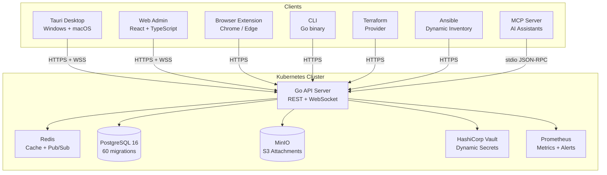

<p align="center">
  
</p>

<h1 align="center">IronStock</h1>

<p align="center">
  <strong>Self-hosted credential vault for DevOps & SRE teams</strong>
</p>

<p align="center">
  <a href="https://github.com/GameOfAI/IronStock/actions/workflows/ci.yml"></a>
  <a href="https://github.com/GameOfAI/IronStock/actions/workflows/security.yml"></a>
  
  
  
  
  
</p>

<p align="center">
  A zero-knowledge credential manager built for infrastructure teams.<br/>
  Store secrets, share with your team, and integrate with your entire DevOps toolchain &mdash;<br/>
  all with client-side end-to-end encryption. The server <em>never</em> sees your plaintext.
</p>

---

<p align="center">
  <a href="#-quick-start">Quick Start</a> &bull;
  <a href="#-download">Download</a> &bull;
  <a href="#-features">Features</a> &bull;
  <a href="#-architecture">Architecture</a> &bull;
  <a href="#-documentation">Docs</a>
</p>

---

## Why IronStock?

Most credential managers treat DevOps as an afterthought. IronStock is built from the ground up for infrastructure teams:

- **Zero-knowledge encryption** &mdash; X25519 key exchange + AES-256-GCM. Your secrets are encrypted client-side before they ever leave your device. The server stores only ciphertext.
- **Native DevOps integrations** &mdash; Terraform provider, Ansible dynamic inventory, CLI tool, MCP server for AI assistants, Kubernetes secret scanning, and HashiCorp Vault proxy &mdash; all built in.
- **Real-time collaboration** &mdash; WebSocket-powered live sync with Redis pub/sub for horizontal scaling. Share a credential and your teammate sees it instantly.
- **Enterprise auth** &mdash; OIDC/LDAP SSO with JWKS verification, SCIM 2.0 provisioning (Azure AD, Okta), WebAuthn/FIDO2, TOTP, and mTLS client certificates.
- **Works everywhere** &mdash; Desktop app (Windows & macOS), browser extension (Chrome/Edge), web admin panel, CLI, and Terraform. Offline mode with encrypted local cache.

---

## Features

| Category | Highlights |
|----------|-----------|
| **Encryption** | Client-side E2E (X25519 + AES-256-GCM), server-side envelope encryption, zero-knowledge architecture |
| **Authentication** | TOTP, WebAuthn/FIDO2, mTLS certificates, OIDC/LDAP SSO, SCIM 2.0 provisioning |
| **Access Control** | RBAC with folder-level permissions, approval/checkout workflows, GeoIP + IP whitelist, time-based access windows |
| **Collaboration** | Per-item sharing with public key wrapping, real-time WebSocket sync, group management |
| **Kubernetes** | Cluster management, secret scanning, dynamic Vault credentials, resource proxy |
| **IaC & Automation** | Terraform provider, Ansible dynamic inventory, CLI tool, MCP server for AI assistants |
| **Monitoring** | Prometheus metrics, Grafana dashboards, alert rules, SLO targets, item health scores |
| **Data Management** | CSV & KeePass import, encrypted bulk export, full-text + fuzzy search, relationship graph |
| **Operations** | Full audit trail, log forwarding (Syslog/Splunk), automated backups, disaster recovery |
| **AI** | MCP server (6 tools) for Claude/ChatGPT, LLM-powered field suggestions |

---

## Download

### Desktop App (Tauri)

<p>
  <a href="https://github.com/GameOfAI/IronStock/releases/latest"></a>
  <a href="https://github.com/GameOfAI/IronStock/releases/latest"></a>
</p>

Download the latest `.msi` (Windows) or `.dmg` (macOS Universal) from [GitHub Releases](https://github.com/GameOfAI/IronStock/releases/latest).

### Browser Extension

<p>
  <a href="#"></a>
  <a href="#"></a>
</p>

One-click autofill from your vault. Also available as an unpacked extension &mdash; see [browser-extension/README.md](browser-extension/README.md).

### CLI

```bash
# macOS (Apple Silicon)
curl -L https://github.com/GameOfAI/IronStock/releases/latest/download/ironstock_darwin_arm64.tar.gz | tar xz
sudo mv ironstock /usr/local/bin/

# Linux (amd64)
curl -L https://github.com/GameOfAI/IronStock/releases/latest/download/ironstock_linux_amd64.tar.gz | tar xz
sudo mv ironstock /usr/local/bin/

# Windows (PowerShell)
Invoke-WebRequest -Uri https://github.com/GameOfAI/IronStock/releases/latest/download/ironstock_windows_amd64.zip -OutFile ironstock.zip
Expand-Archive ironstock.zip -DestinationPath $env:LOCALAPPDATA\ironstock
```

See [cli/README.md](cli/README.md) for full command reference.

---

## Quick Start

Get a local instance running in 30 seconds:

```bash
git clone https://github.com/GameOfAI/IronStock.git
cd IronStock

# Start PostgreSQL, MinIO, Redis, and supporting services
make up

# Apply database migrations
make migrate

# Start the API server
make run

# In another terminal — start the admin web UI
cd web && npm install && npm run dev
```

Open [http://localhost:5173](http://localhost:5173) and create your first admin account.

---

## Architecture



### Encryption Boundary

```
 Client Device                    Server (Kubernetes)
 ┌──────────────────┐            ┌──────────────────────────┐
 │                  │            │                          │
 │  Plaintext       │───E2E────▶│  Ciphertext only         │
 │  (user sees)     │  encrypt  │  (server never decrypts) │
 │                  │            │                          │
 │  Argon2id KDF    │            │  Envelope encryption     │
 │  X25519 key wrap │            │  (metadata fields)       │
 │  AES-256-GCM     │            │                          │
 └──────────────────┘            └──────────────────────────┘
```

---

## Components

| Component | Description | README |
|-----------|-------------|--------|
| **[server/](server/)** | Go REST + WebSocket API &mdash; auth, crypto, RBAC, audit, integrations | [server/README.md](server/README.md) |
| **[web/](web/)** | React 18 admin panel &mdash; full vault management UI | [web/README.md](web/README.md) |
| **[client/](client/)** | Tauri 2 desktop app &mdash; native Windows & macOS with offline mode | [client/README.md](client/README.md) |
| **[browser-extension/](browser-extension/)** | Chrome/Edge extension &mdash; autofill credentials from vault | [browser-extension/README.md](browser-extension/README.md) |
| **[cli/](cli/)** | `ironstock` CLI &mdash; terminal access to your vault | [cli/README.md](cli/README.md) |
| **[terraform/](terraform/)** | Terraform provider &mdash; manage vault resources as code | [terraform/README.md](terraform/README.md) |
| **[deploy/](deploy/)** | Kubernetes manifests + Docker Compose | [deploy/README.md](deploy/README.md) |
| **[shared/](shared/)** | OpenAPI spec + shared TypeScript types | [shared/api/README.md](shared/api/README.md) |
| **[docs/](docs/)** | Architecture decisions, ops guides, security docs | [docs/README.md](docs/README.md) |
| **[e2e/](e2e/)** | Playwright end-to-end tests | &mdash; |

---

## Tech Stack

| Layer | Technology |
|-------|-----------|
| **Backend** | Go 1.22, chi v5, pgx/v5, Redis, MinIO |
| **Web Frontend** | React 18, TypeScript, Vite, Tailwind CSS 4, shadcn/ui, TanStack Query |
| **Desktop** | Tauri 2 (Rust), React, system tray, auto-updater |
| **Browser Extension** | Manifest V3, Chrome/Edge, service worker |
| **CLI** | Go, Cobra, GoReleaser |
| **IaC** | Terraform Plugin Framework |
| **Database** | PostgreSQL 16, 60 migrations |
| **Crypto** | Argon2id, X25519, AES-256-GCM, WebAuthn, FIDO2 |
| **Auth** | JWT (HS256), TOTP, OIDC/LDAP SSO, SCIM 2.0, mTLS |
| **Monitoring** | Prometheus, Grafana, 5 alert rule groups |
| **CI/CD** | GitHub Actions, GoReleaser, Kustomize |

---

## Security

IronStock uses a hybrid encryption model:

- **Secret fields** (passwords, tokens, API keys) are encrypted client-side with X25519 + AES-256-GCM. The server stores only ciphertext and cannot decrypt these values.
- **Metadata** (names, descriptions, hostnames) is protected with server-side envelope encryption.
- **Sharing** uses per-item DEKs wrapped with recipient public keys &mdash; no master key sharing.

Additional security measures:

- Session revocation with database-backed session checking
- OIDC JWKS signature verification with key caching
- SSRF protection for Kubernetes cluster URLs
- Path traversal guards for Vault operations
- Rate limiting (token bucket + Redis sliding window)
- GeoIP and CIDR-based access control
- Full audit trail with structured events

See [docs/security/threat-model.md](docs/security/threat-model.md) for the full threat model.

---

## Contributing

```bash
# Run all tests
make test                  # Server (Go)
cd web && npm test         # Web (179 tests)
cd cli && go test ./...    # CLI
cd terraform && go test ./... # Terraform provider

# Lint
make lint                  # Go (golangci-lint + gofmt)
cd web && npm run lint     # Web (ESLint)
```

Pre-commit hooks enforce: gofmt, go mod tidy, ESLint, gitleaks secret scanning, and tracking file updates.

---

## License

MIT License. See [LICENSE](LICENSE) for details.
