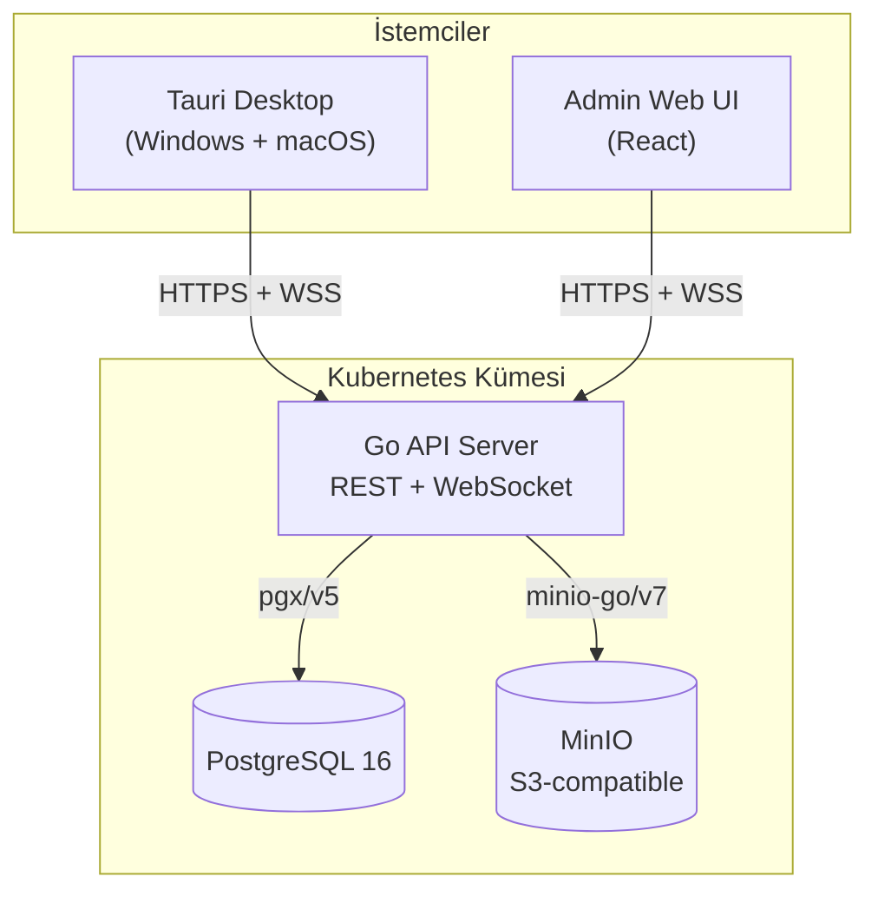
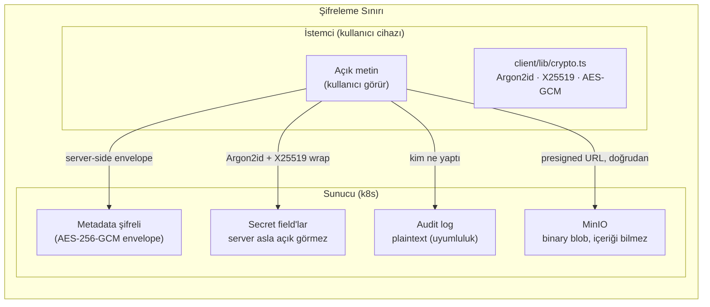
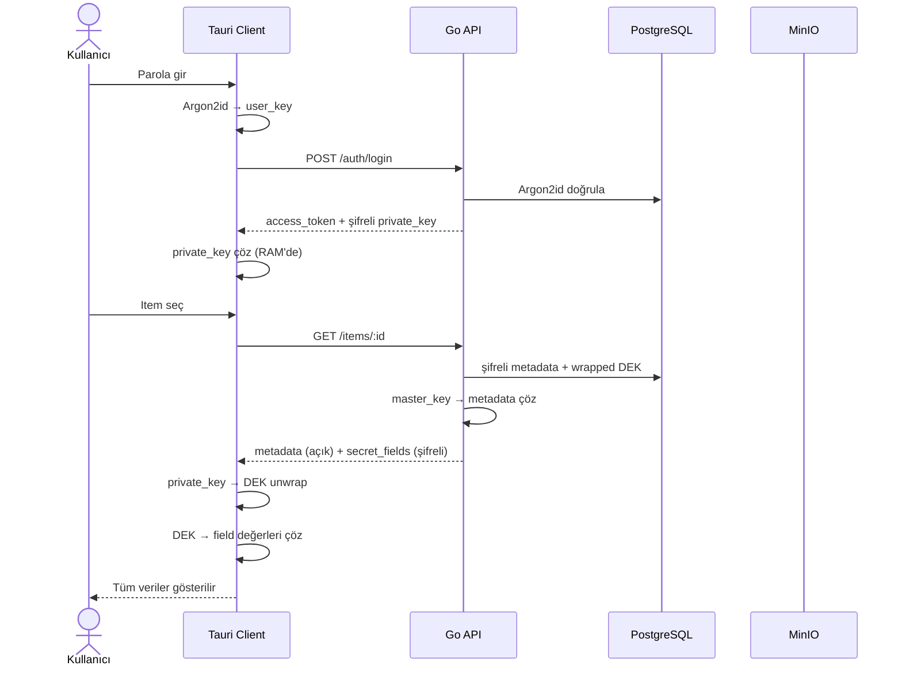

# Envanter App

[](https://github.com/bhaslaman/Envanter_App/actions/workflows/ci.yml)

DevOps/SRE takımı için merkezi envanter ve credential yönetimi.
KeePassXC'ye alternatif — canlı sync, TOTP MFA, RBAC ve client-side E2E şifreleme.

**Durum:** `v1.0.0` — Production-ready. Tüm fazlar tamamlandı ✅

---

## Mimari Genel Bakış



---

## Şifreleme Sınırı



---

## İstek Yaşam Döngüsü



---

## Özellikler

| Kategori | Özellik |
|----------|---------|
| **Auth** | Username + Argon2id, TOTP (RFC 6238), JWT access/refresh |
| **Yetkilendirme** | Folder-level RBAC — `read` / `write` rolleri |
| **Şifreleme** | Metadata → server-side AES-256-GCM envelope; Secret field → client-side X25519 E2E |
| **Paylaşım** | Per-item DEK, yetkili kullanıcıların public key'iyle wrap |
| **Live Sync** | WebSocket hub — anlık item/folder değişiklik bildirimi |
| **Offline Cache** | Client bağlantısı koparsa son veriye şifreli erişim |
| **Dosya Ekleri** | MinIO presigned URL upload/download — server plaintext görmez |
| **Audit Log** | Tüm mutasyonlar server-side plaintext kaydı |
| **Metrikler** | Prometheus `/metrics` endpoint |

---

## Dizin Yapısı

```
├── server/          # Go backend — REST + WebSocket + şifreleme
├── client/          # Tauri desktop app (Windows + macOS)
├── web/             # React admin web UI
├── shared/          # OpenAPI spec + oluşturulan TypeScript tipleri
├── deploy/
│   ├── k8s/         # Kubernetes manifests + Kustomize
│   └── compose/     # Docker Compose (local dev)
└── docs/
    └── adr/         # Architecture Decision Records (0001–0007)
```

Her katmanın ayrıntılı belgesi ilgili dizindeki `README.md`'dedir:
[server/README.md](server/README.md) · [client/README.md](client/README.md) · [web/README.md](web/README.md) · [deploy/README.md](deploy/README.md)

---

## Hızlı Başlangıç (Geliştirici)

Gereksinimler: **Docker**, **Go 1.22+**, **Node 20+**, **Rust 1.75+**

```bash
# 1. Dev stack başlat (Postgres + MinIO + Adminer + Mailhog)
make up

# 2. Migrasyonları uygula
make migrate

# 3. Server'ı çalıştır
make run

# 4. Admin Web UI (ayrı terminal)
cd web && npm run dev

# 5. Desktop client (ayrı terminal)
cd client && npm run tauri:dev
```

Tüm komutlar için: `make help`

---

## Güvenlik Modeli (Özet)

```
Metadata (isim, IP, hostname)   → Server-side envelope encryption (AES-256-GCM)
Secret field (parola, token)    → Client-side E2E (Argon2id KDF + X25519 wrap)
Audit log                       → Server-side plaintext (uyumluluk için)
Attachments                     → MinIO presigned URL — server plaintext görmez
```

Detay: [docs/adr/0002-security-model.md](docs/adr/0002-security-model.md)

---

## CI/CD

| Tetikleyici | Çalışan Job'lar |
|-------------|----------------|
| PR → main | Server (lint+test+build), Web (lint+test+build), Client (TS check), Integration tests |
| Push → main | + Docker Build & Push (GHCR), Kustomize image tag update |
| Push `v*` tag | + Tauri binary (Win NSIS + macOS Universal DMG), GitHub Release |

Container registry: `ghcr.io/gameofai/envanter-api` / `envanter-web`

---

## Dokümantasyon

| Dosya | İçerik |
|-------|--------|
| [PROGRESS.md](PROGRESS.md) | Faz durumu + geliştirme günlüğü |
| [RULES.md](RULES.md) | Kod, commit ve test kuralları |
| [TODO.md](TODO.md) | Tamamlanan ve planlanan task'lar |
| [docs/adr/0001](docs/adr/0001-tech-stack.md) | Tech stack kararı |
| [docs/adr/0002](docs/adr/0002-security-model.md) | Hibrit şifreleme modeli |
| [docs/adr/0003](docs/adr/0003-repo-layout.md) | Monorepo yapısı |

---

## Lisans

Proprietary — internal project.
