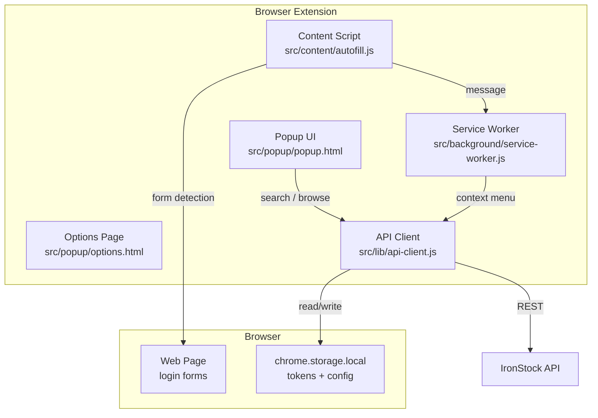

# IronStock Autofill — Browser Extension

<p>
  
  
  
  
</p>

One-click credential autofill from your IronStock vault directly in the browser. Search, browse, and fill login forms without leaving the page.

---

## Features

- **One-click autofill** &mdash; detect login forms and fill credentials from your vault
- **Popup search** &mdash; instant vault search with keyboard shortcut
- **Context menu** &mdash; right-click to autofill or copy credentials
- **TOTP-aware login** &mdash; supports two-factor authentication during sign-in
- **Auto token refresh** &mdash; seamless session renewal with mutex-based deduplication
- **Configurable server** &mdash; connect to any self-hosted IronStock instance

---

## Architecture



### Token Refresh Flow

The API client implements a **Promise-based mutex** for concurrent token refresh. When multiple requests hit a 401 simultaneously, only one refresh request is sent &mdash; all others await the same Promise:

```
Request A (401) ──┐
                   ├──▶ Single refresh request ──▶ New token
Request B (401) ──┘
                   ├──▶ Retry A with new token
                   └──▶ Retry B with new token
```

---

## Installation

### From Source (Developer Mode)

```bash
cd browser-extension
npm install

# Load in Chrome/Edge:
# 1. Navigate to chrome://extensions
# 2. Enable "Developer mode"
# 3. Click "Load unpacked"
# 4. Select the browser-extension/ directory
```

### Configuration

1. Click the extension icon
2. Go to Options (gear icon)
3. Enter your IronStock server URL (e.g., `https://vault.example.com`)
4. Log in with your credentials

---

## Project Structure

```
browser-extension/
├── manifest.json              # Extension manifest (V3)
├── icons/                     # Extension icons (16/32/48/128px)
├── src/
│   ├── background/
│   │   └── service-worker.js  # Background tasks, context menu, message routing
│   ├── content/
│   │   └── autofill.js        # DOM injection, form detection, autofill logic
│   ├── popup/
│   │   ├── popup.html         # Popup UI markup
│   │   ├── popup.js           # Search, item list, login flow
│   │   └── options.html       # Server URL configuration
│   └── lib/
│       ├── api-client.js      # REST client with token refresh mutex
│       └── api-client.test.js # 15 unit tests
├── vitest.config.js           # Test configuration
└── package.json               # Dependencies (vitest)
```

---

## API Client

The shared API client (`src/lib/api-client.js`) handles all server communication:

| Function | Description |
|----------|-------------|
| `getConfig()` | Read server URL + tokens from chrome.storage |
| `saveConfig(config)` | Persist configuration |
| `clearConfig()` | Remove all stored credentials |
| `isAuthenticated()` | Check if server URL and token are set |
| `login(url, username, password, totpCode?)` | Authenticate (with optional TOTP) |
| `logout()` | Server-side session revocation + clear local config |
| `searchItems(query)` | Search vault items by name |

All authenticated requests automatically refresh expired tokens. Concurrent 401 responses trigger a single refresh via the mutex pattern.

---

## Testing

```bash
cd browser-extension
npx vitest run
```

**15 tests** covering:
- Configuration CRUD (get, save, clear)
- Authentication state (isAuthenticated)
- Login flow (success, TOTP required, TOTP code, failure)
- Logout with server revocation
- Item search with encoded query
- Token refresh (success, failure, mutex deduplication)

---

## Development

```bash
# Run tests in watch mode
npx vitest

# The extension uses plain JavaScript (no build step required)
# After code changes, reload the extension in chrome://extensions
```

---

## Permissions

| Permission | Reason |
|-----------|--------|
| `activeTab` | Access current tab for form detection |
| `storage` | Store server URL and authentication tokens |
| `contextMenus` | Right-click menu for autofill actions |
| `<all_urls>` | Content script injection for form autofill |
