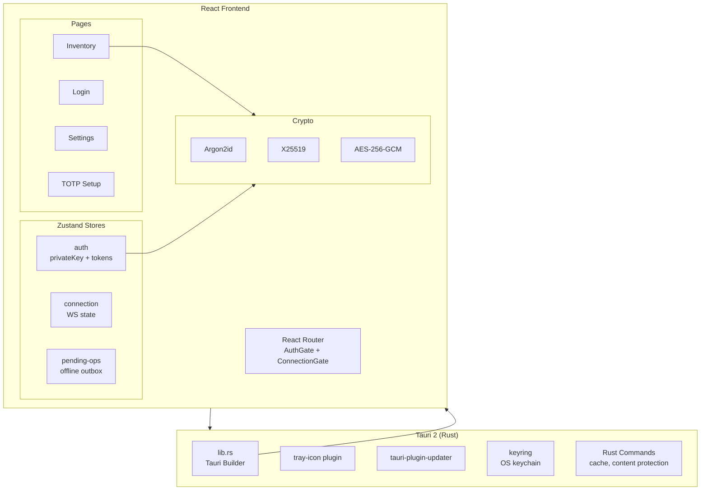
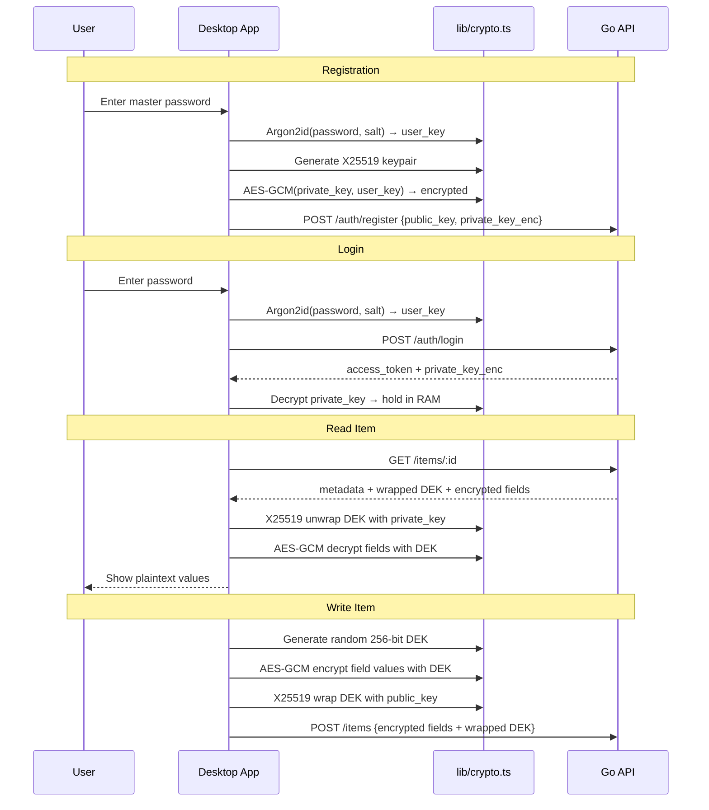
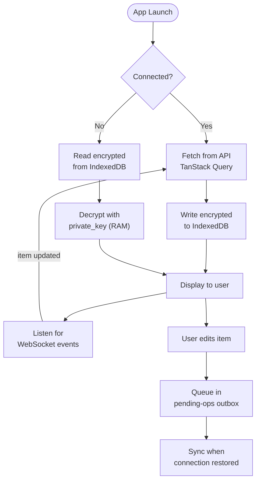
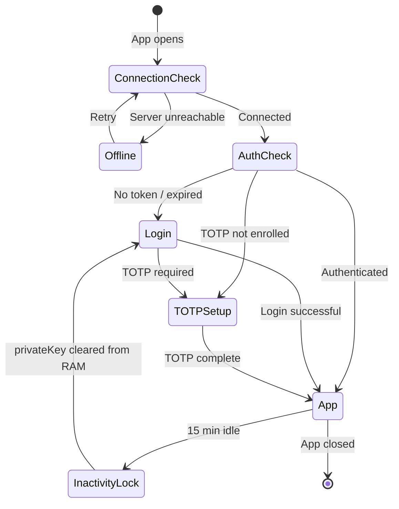

# IronStock Desktop

<p>
  <a href="https://github.com/GameOfAI/IronStock/releases/latest"></a>
  <a href="https://github.com/GameOfAI/IronStock/releases/latest"></a>
</p>

<p>
  
  
  
</p>

Native desktop application for IronStock. Full vault access with client-side E2E encryption, offline mode, and system tray integration.

---

## Download

| Platform | Format | Link |
|----------|--------|------|
| Windows | `.msi` installer | [Download](https://github.com/GameOfAI/IronStock/releases/latest) |
| macOS | `.dmg` universal (Intel + Apple Silicon) | [Download](https://github.com/GameOfAI/IronStock/releases/latest) |

---

## Features

- **Zero-knowledge encryption** &mdash; X25519 + AES-256-GCM client-side. Server never sees plaintext.
- **Offline mode** &mdash; encrypted IndexedDB cache with outbox for pending writes. Works without connectivity.
- **Auto-sync** &mdash; WebSocket real-time updates with automatic reconnection.
- **Inactivity lock** &mdash; auto-locks after 15 minutes, clears private key from RAM.
- **System tray** &mdash; quick access from taskbar/menu bar.
- **Auto-updater** &mdash; server-based update checking and installation.
- **Screen capture protection** &mdash; content protection API prevents screenshots.
- **mTLS support** &mdash; client certificate authentication with .p12 picker.
- **Multi-factor auth** &mdash; TOTP and WebAuthn/FIDO2 support.
- **Connection gate** &mdash; graceful offline/reconnect UX.

---

## Architecture



---

## E2E Encryption Flow



---

## Offline Mode



---

## Application State Machine



---

## Key Files

| File | Purpose |
|------|---------|
| `src/store/auth.ts` | `privateKey`, `accessToken`, `user` &mdash; app-wide auth state |
| `src/lib/crypto.ts` | `openDEKWithKEK`, `decryptField`, `encryptField`, `fromBase64` |
| `src/api/client.ts` | Fetch wrapper with 401 auto-refresh |
| `src/api/ws.ts` | WebSocket with heartbeat + reconnection |
| `src/components/inventory/item-detail.tsx` | DEK unwrap, field display, clipboard auto-clear (30s) |
| `src/components/inventory/item-form-modal.tsx` | E2E encrypted field creation |
| `src/routes/auth-gate.tsx` | Auth + TOTP state checking |
| `src/routes/connection-gate.tsx` | Server reachability gate |
| `src/hooks/use-inactivity-lock.ts` | Auto-lock on idle |
| `src-tauri/src/lib.rs` | Tauri builder + plugin registration |

---

## Tauri Plugins

| Plugin | Purpose |
|--------|---------|
| `tray-icon` | System tray icon and right-click menu |
| `tauri-plugin-updater` | Server-based auto-update |
| `keyring` | OS keychain integration for optional token persistence |

---

## Development

### Prerequisites

- **Node.js** 20+
- **Rust** 1.75+ (for Tauri)
- **Windows:** MS Build Tools + WebView2
- **macOS:** Xcode CLI tools (`xcode-select --install`)

### Setup

```bash
cd client
npm install

# Dev mode (opens Tauri window with HMR)
npm run tauri:dev

# Frontend only (no Tauri)
npm run dev

# Tests
npm test

# Lint + type check
npm run lint && npx tsc -b
```

### Release Build

```bash
npm run tauri:build

# Output: src-tauri/target/release/bundle/
#   Windows: .msi (NSIS installer)
#   macOS:   .dmg (Universal binary)
```

---

## Project Structure

```
client/
├── src/                          # React frontend
│   ├── pages/                    # Login, inventory, config, admin
│   ├── components/               # Inventory, layout, UI
│   ├── api/                      # REST + WebSocket clients
│   ├── lib/                      # Crypto, WebAuthn, utilities
│   ├── store/                    # Zustand (auth, connection, pending-ops)
│   ├── hooks/                    # Inactivity lock, offline sync
│   └── routes/                   # Auth gate, connection gate
├── src-tauri/                    # Rust backend
│   ├── src/lib.rs                # Tauri builder + commands
│   ├── Cargo.toml                # Rust dependencies
│   ├── tauri.conf.json           # App config (IronStock, 1200x800)
│   ├── capabilities/             # Permission scoping
│   └── icons/                    # App icons
├── package.json
└── vite.config.ts
```
