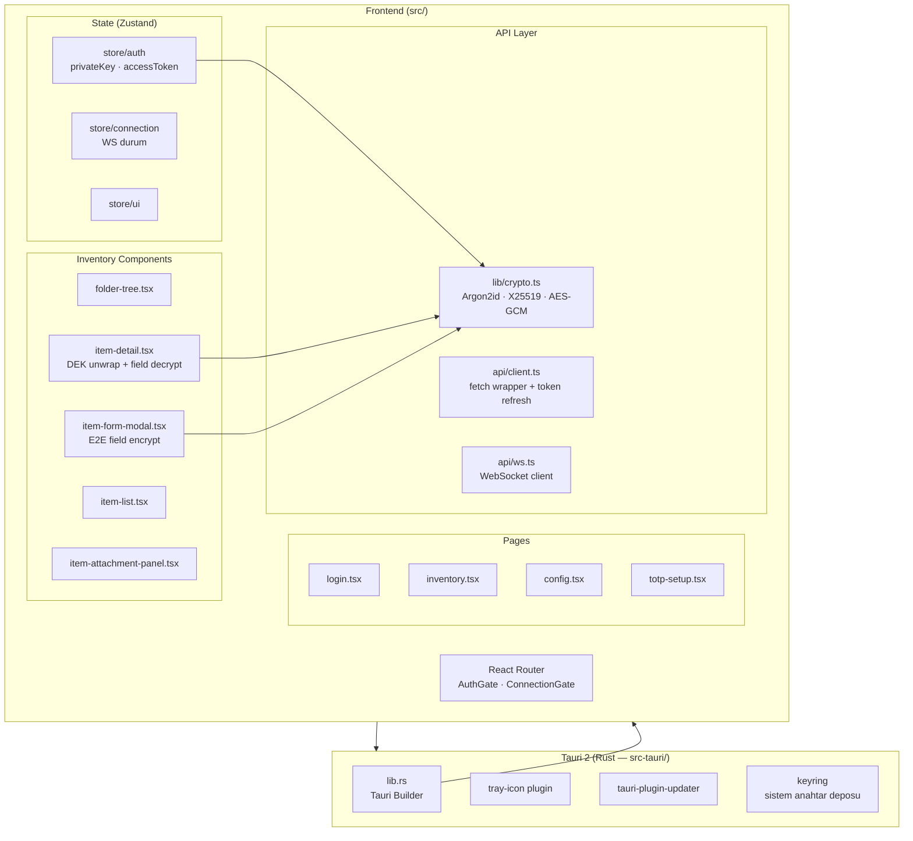
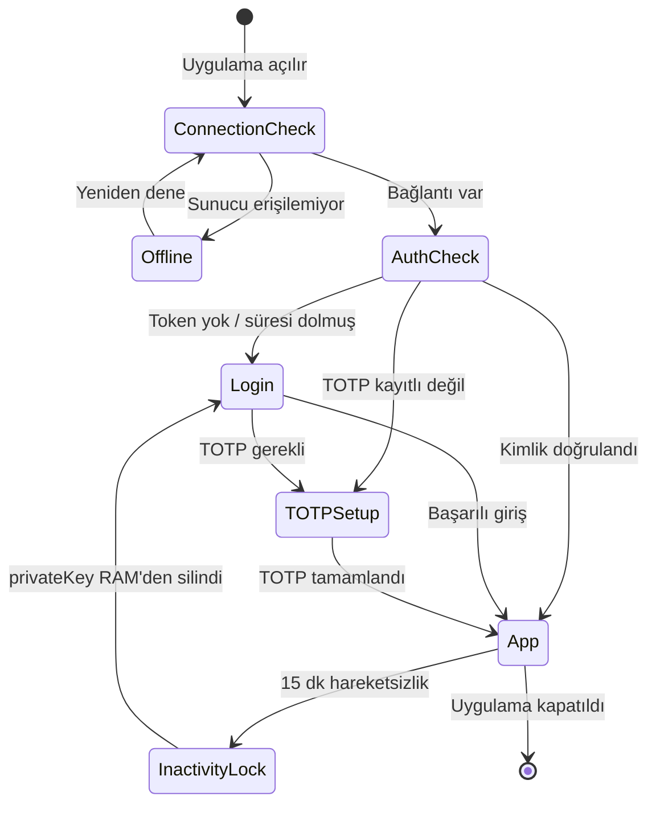
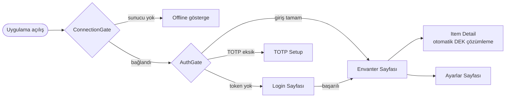
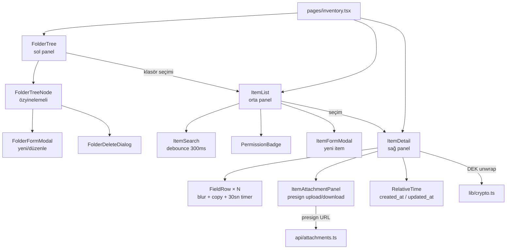
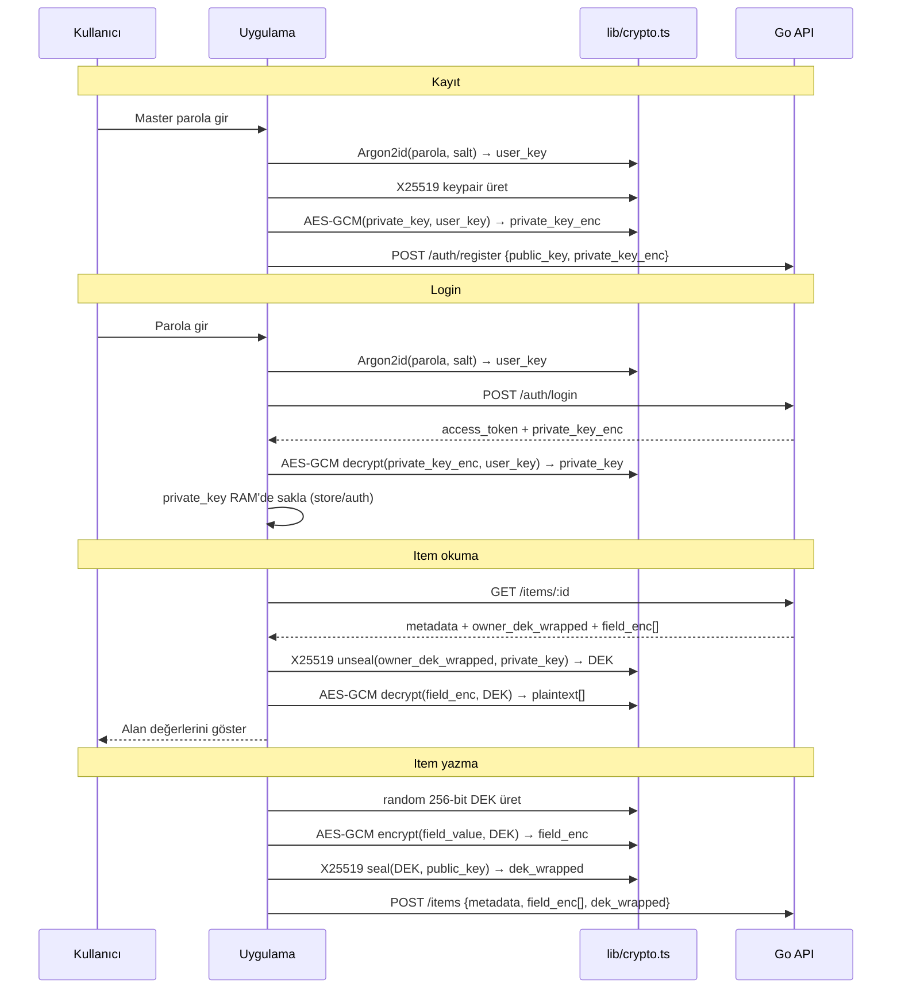
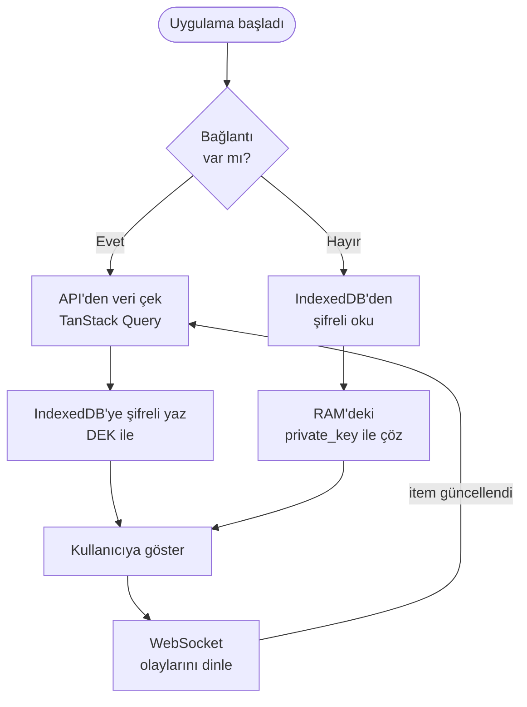

# Client (Tauri Desktop)

Windows ve macOS için native desktop uygulaması.
Tauri 2 (Rust) + React 18 + TypeScript yapısı. Client-side E2E şifreleme, offline cache ve system tray desteği içerir.

---

## Mimari



---

## Uygulama Durum Makinesi



---

## Sayfa Akışı



---

## Inventory Sayfası Bileşen Ağacı



---

## E2E Şifreleme (Client Tarafı)



---

## Offline Cache Akışı



---

## Temel Dosyalar

| Dosya | Açıklama |
|-------|---------|
| `src/store/auth.ts` | `privateKey`, `accessToken`, `user` — uygulama geneli auth durumu |
| `src/lib/crypto.ts` | `openDEKWithKEK`, `decryptField`, `encryptField`, `fromBase64` |
| `src/api/client.ts` | Fetch wrapper — 401'de otomatik token yenileme |
| `src/api/ws.ts` | WebSocket bağlantısı + heartbeat + yeniden bağlanma |
| `src/components/inventory/item-detail.tsx` | DEK çözme, alan görüntüleme, pano temizleme (30sn) |
| `src/components/inventory/item-form-modal.tsx` | Yeni/düzenle modal — şifreli field yazma |
| `src/routes/auth-gate.tsx` | Auth + TOTP durumu kontrolü |
| `src/routes/connection-gate.tsx` | Sunucu erişilebilirlik kontrolü |
| `src/hooks/use-inactivity-lock.ts` | Hareketsizlik sonrası otomatik kilit |

---

## Kurulum ve Derleme

```bash
cd client

# Bağımlılıklar
npm install

# Dev modu (Tauri penceresiyle)
npm run tauri:dev

# Sadece frontend dev
npm run dev

# Release build
npm run tauri:build
# Çıktı: src-tauri/target/release/bundle/
#   Windows: .msi (NSIS installer)
#   macOS:   .dmg (Universal — arm64 + x86_64)

# Testler
npm test

# Lint + tip kontrolü
npm run lint && npx tsc -b
```

Platform gereksinimleri:
- **Windows:** MS Build Tools + WebView2
- **macOS:** Xcode CLI tools (`xcode-select --install`)

---

## Tauri Eklentileri

| Eklenti | Kullanım |
|---------|---------|
| `tray-icon` | System tray simgesi ve sağ-tık menüsü |
| `tauri-plugin-updater` | Otomatik güncelleme (sunucu tabanlı) |
| `keyring` | OS anahtar deposu — opsiyonel token kalıcılığı |
