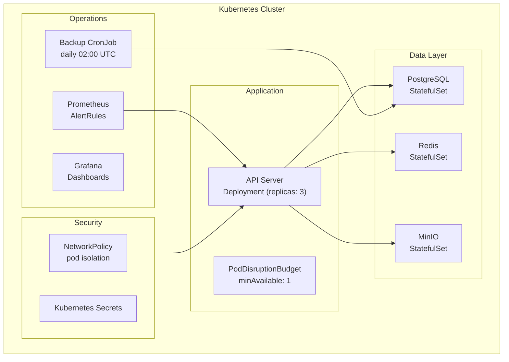

# IronStock Deployment

<p>
  
  
  
</p>

Kubernetes manifests for production deployment and Docker Compose for local development.

---

## Quick Start (Local Development)

```bash
# Start all dependencies
make up

# Services started:
#   PostgreSQL 16    → localhost:5432
#   MinIO (S3)       → localhost:9000 (console: 9001)
#   Redis            → localhost:6379
#   Adminer (DB UI)  → localhost:8081
#   Mailhog (SMTP)   → localhost:8025

# Stop (preserve data)
make down

# Full reset (delete volumes)
docker compose -f deploy/compose/docker-compose.yml down -v
```

---

## Kubernetes Deployment

### Prerequisites

- Kubernetes 1.28+
- `kubectl` configured
- Secrets created (see below)

### Deploy

```bash
# Create namespace
kubectl create namespace ironstock

# Create secrets
kubectl create secret generic ironstock-secrets \
  --namespace ironstock \
  --from-literal=ENVANTER_MASTER_KEY=$(openssl rand -hex 32) \
  --from-literal=ENVANTER_JWT_SECRET=$(openssl rand -hex 32) \
  --from-literal=ENVANTER_DATABASE_URL=postgres://...

# Apply manifests
kubectl apply -f deploy/k8s/ -n ironstock

# Verify
kubectl get pods -n ironstock
```

### ArgoCD

The manifests are ArgoCD-compatible. Point an Application to `deploy/k8s/` for GitOps:

```yaml
apiVersion: argoproj.io/v1alpha1
kind: Application
metadata:
  name: ironstock
spec:
  source:
    repoURL: https://github.com/GameOfAI/IronStock.git
    path: deploy/k8s
  destination:
    namespace: ironstock
```

---

## Architecture



---

## Manifest Reference

| File | Kind | Description |
|------|------|-------------|
| `api.yaml` | Deployment + Service + PDB | Go API server (3 replicas, pod disruption budget) |
| `postgres.yaml` | StatefulSet + Service | PostgreSQL 16 with persistent volume |
| `redis.yaml` | StatefulSet + Service | Redis for caching + pub/sub |
| `minio.yaml` | StatefulSet + Service | S3-compatible object storage |
| `adminer.yaml` | Deployment + Service | Database admin UI (dev only) |
| `network-policy.yaml` | NetworkPolicy | Pod-to-pod communication rules |
| `cronjob-backup.yaml` | CronJob | Automated daily database backups |
| `prometheus-rules.yaml` | PrometheusRule | Alert rules (5 groups) |

---

## Network Policies

| Target | Allowed Sources | Port |
|--------|----------------|------|
| API Server | Ingress, monitoring | 8080 |
| PostgreSQL | API Server only | 5432 |
| Redis | API Server only | 6379 |
| MinIO | API Server only | 9000 |
| Adminer | Developer IPs only | 8081 |

---

## Backup & Restore

### Automated Backups

The `cronjob-backup.yaml` runs daily at 02:00 UTC:

```bash
# Manual backup trigger
kubectl create job --from=cronjob/ironstock-backup manual-backup -n ironstock

# Restore from backup
./scripts/restore.sh <backup-file>
```

See [docs/ops/backup.md](../docs/ops/backup.md) and [docs/ops/restore.md](../docs/ops/restore.md).

---

## Monitoring

### Prometheus Alert Rules

5 alert groups defined in `prometheus-rules.yaml`:

| Alert | Severity | Condition |
|-------|----------|-----------|
| `CredentialsExpiringSoon` | warning | Credentials expiring within 7 or 30 days |
| `CredentialsExpired` | critical | Expired credentials detected |
| `ItemsUnhealthy` | warning | Items with health score below threshold |
| `HighAuthFailureRate` | critical | Auth failure rate above normal |
| `BreakGlassActive` | critical | Break-glass login detected |
| `APIHighErrorRate` | warning | API 5xx rate above SLO |
| `APIHighLatency` | warning | P99 latency above SLO target |

### Grafana Dashboards

Pre-built dashboards in `deploy/grafana/`:
- API performance (latency, throughput, error rates)
- Authentication metrics
- Database connection pool

---

## Scaling

The API server supports horizontal scaling with Redis:

```yaml
# api.yaml
spec:
  replicas: 3  # Scale as needed
```

- **WebSocket fan-out** &mdash; Redis pub/sub distributes events across all replicas
- **Rate limiting** &mdash; Redis sliding window (Lua script) for consistent limits
- **Session state** &mdash; PostgreSQL-backed sessions work across replicas
- **PDB** &mdash; Pod Disruption Budget ensures minimum 1 available during updates

---

## Security Hardening

- Non-root containers with read-only root filesystem
- Resource limits (CPU/memory) on all pods
- NetworkPolicy restricting pod-to-pod communication
- Secrets managed via Kubernetes Secrets (Sealed Secrets recommended for GitOps)
- TLS termination at ingress
- Security contexts with `allowPrivilegeEscalation: false`

See [docs/ops/sealed-secrets.md](../docs/ops/sealed-secrets.md) for Sealed Secrets setup.

---

## Directory Structure

```
deploy/
├── k8s/                         # Kubernetes manifests
│   ├── api.yaml                 # API server (Deployment + Service + PDB)
│   ├── postgres.yaml            # PostgreSQL StatefulSet
│   ├── redis.yaml               # Redis StatefulSet
│   ├── minio.yaml               # MinIO StatefulSet
│   ├── adminer.yaml             # Database admin (dev)
│   ├── network-policy.yaml      # Pod isolation rules
│   ├── cronjob-backup.yaml      # Daily backup job
│   └── prometheus-rules.yaml    # Alert rules
├── compose/
│   ├── docker-compose.yml       # Local dev stack
│   └── README.md
└── grafana/                     # Dashboard JSON files
```
