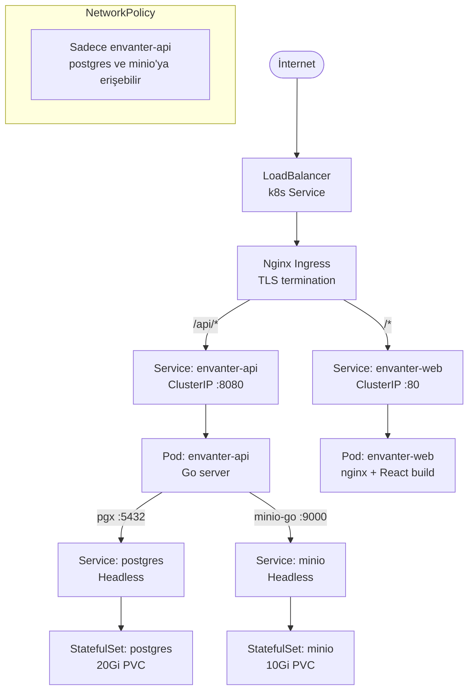
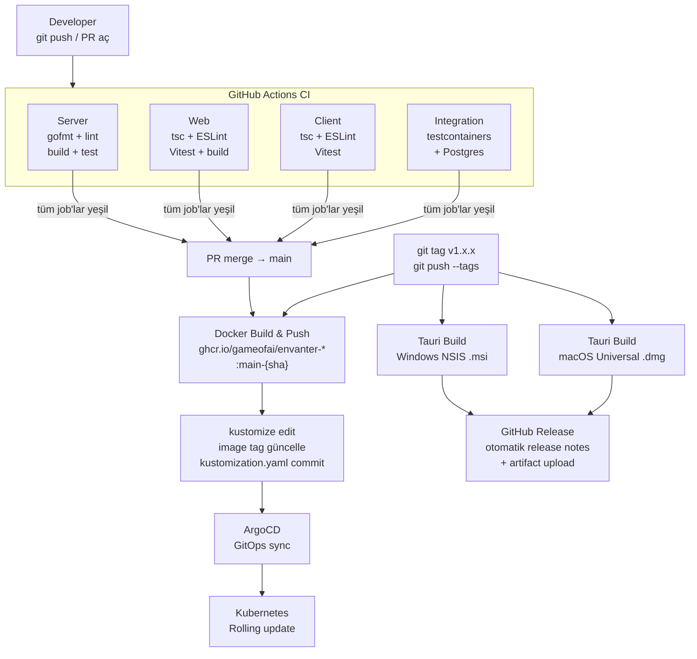
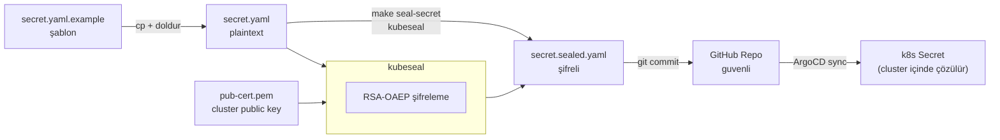

# Deploy

Kubernetes manifests (Kustomize) ve Docker Compose (yerel geliştirme).

---

## Yerel Geliştirme — Docker Compose

```bash
# Tüm servisler (Postgres + MinIO + Adminer + Mailhog)
make up

# Durumu gör
docker compose -f deploy/compose/docker-compose.yml ps

# Durdur (volume'ları koru)
make down

# Volume dahil tamamen sıfırla
docker compose -f deploy/compose/docker-compose.yml down -v
```

| Servis | Port | Amaç |
|--------|------|------|
| PostgreSQL 16 | `5432` | Ana veritabanı |
| MinIO | `9000` (API) / `9001` (console) | S3-compatible nesne depolama |
| Adminer | `8081` | Veritabanı web arayüzü |
| Mailhog | `8025` (UI) / `1025` (SMTP) | Geliştirme e-posta yakalama |

---

## Kubernetes — Ağ Topolojisi



---

## CI/CD → Production Akışı



---

## Kubernetes Manifest Dosyaları

| Dosya | İçerik |
|-------|--------|
| `namespace.yaml` | `envanter` namespace |
| `configmap.yaml` | Env değişkenleri (port, host'lar, feature flag'ler) |
| `postgres.yaml` | StatefulSet + headless Service + 20Gi PVC |
| `minio.yaml` | StatefulSet + headless Service + 10Gi PVC |
| `api.yaml` | Deployment + Service + HPA (2–10 replica) |
| `web.yaml` | Deployment + Service (nginx) |
| `adminer.yaml` | Tek replica Deployment + Service |
| `mailhog.yaml` | Tek replica Deployment + Service |
| `ingress.yaml` | Nginx Ingress + TLS termination |
| `network-policy.yaml` | Pod arası erişim kısıtlamaları |
| `servicemonitor.yaml` | Prometheus ServiceMonitor (kube-prometheus-stack) |
| `kustomization.yaml` | Kustomize overlay — image tag yönetimi |
| `secret.yaml.example` | Secret şablonu (commit edilmez) |
| `secret.sealed.yaml` | Kubeseal ile şifrelenmiş secret (repo'da güvenli) |
| `argocd-app.yaml` | ArgoCD Application tanımı |

---

## Secret Yönetimi (Sealed Secrets)



```bash
# 1. Şablondan secret.yaml oluştur
cp deploy/k8s/secret.yaml.example deploy/k8s/secret.yaml

# 2. Değerleri doldur
ENVANTER_MASTER_KEY=$(openssl rand -base64 32)
ENVANTER_JWT_SECRET=$(openssl rand -base64 32)
POSTGRES_PASSWORD=$(openssl rand -base64 24)
# ... secret.yaml içinde değerleri güncelle

# 3. Kubeseal ile şifrele
make seal-secret          # → deploy/k8s/secret.sealed.yaml

# 4. Şifreli dosyayı commit'le (güvenli)
git add deploy/k8s/secret.sealed.yaml
git commit -m "chore(deploy): update sealed secret"
```

| Secret Key | Açıklama |
|-----------|---------|
| `ENVANTER_MASTER_KEY` | Server-side envelope şifreleme master key (32B, base64) |
| `ENVANTER_JWT_SECRET` | JWT token imzalama (32B, base64) |
| `POSTGRES_PASSWORD` | PostgreSQL şifresi |
| `ENVANTER_DB_URL` | Full PostgreSQL bağlantı string'i |
| `MINIO_ROOT_USER` | MinIO root kullanıcı adı |
| `MINIO_ROOT_PASSWORD` | MinIO root şifresi |
| `ENVANTER_MINIO_ACCESS_KEY` | API erişim anahtarı |
| `ENVANTER_MINIO_SECRET_KEY` | API gizli anahtar |

Detay: `docs/ops/sealed-secrets.md`

---

## ArgoCD

```bash
# Manuel sync (otomatik sync açıksa gerekli değil)
argocd app sync envanter

# Durum
argocd app get envanter
```

`deploy/k8s/argocd-app.yaml` içinde sync politikası ve health check kriterleri tanımlıdır.

---

## Prometheus Metrikleri

`servicemonitor.yaml` Prometheus Operator'a `/metrics` endpoint'ini bildirir.
`kustomization.yaml` içinde varsayılan olarak yorum satırında — kube-prometheus-stack kuruluysa açılır:

```yaml
# kustomization.yaml
resources:
  # - servicemonitor.yaml  # uncomment when prometheus-operator installed
```
