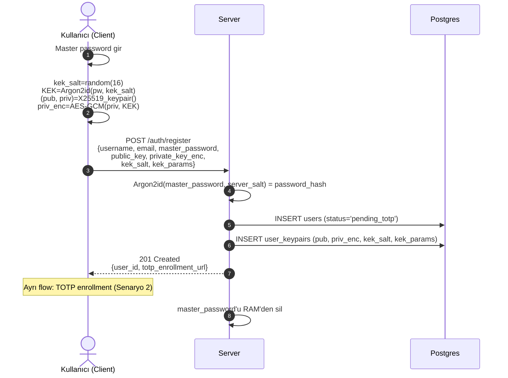
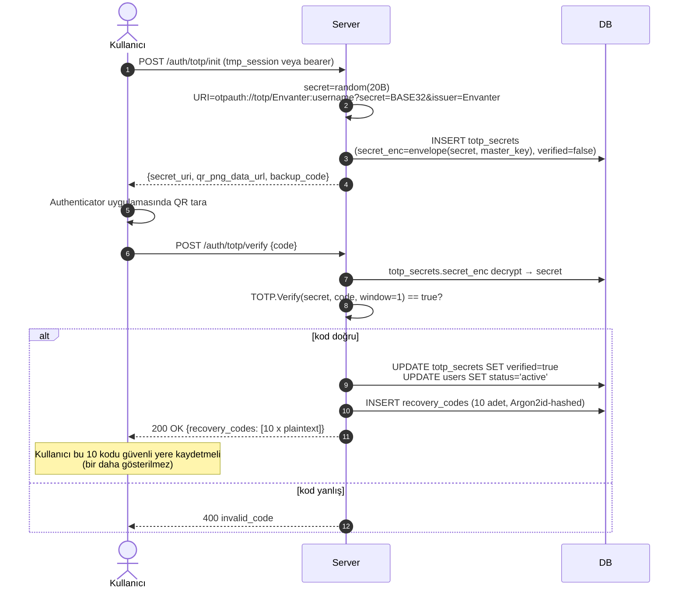
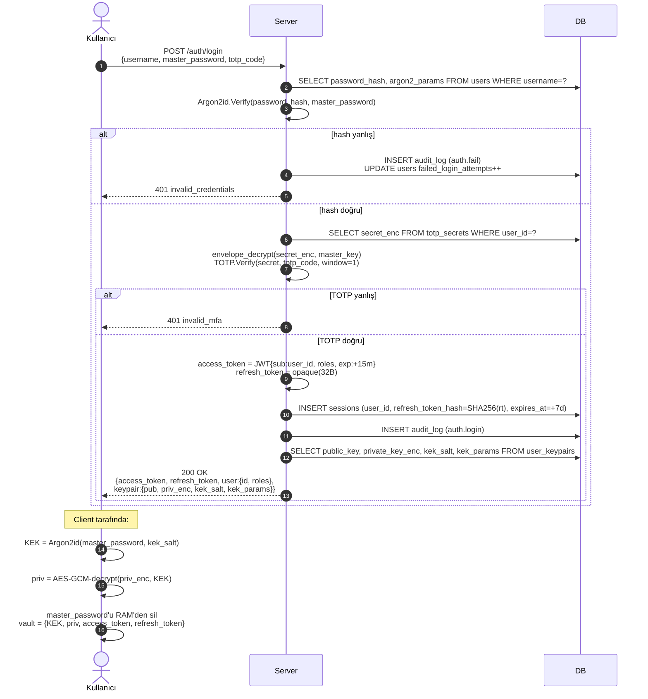
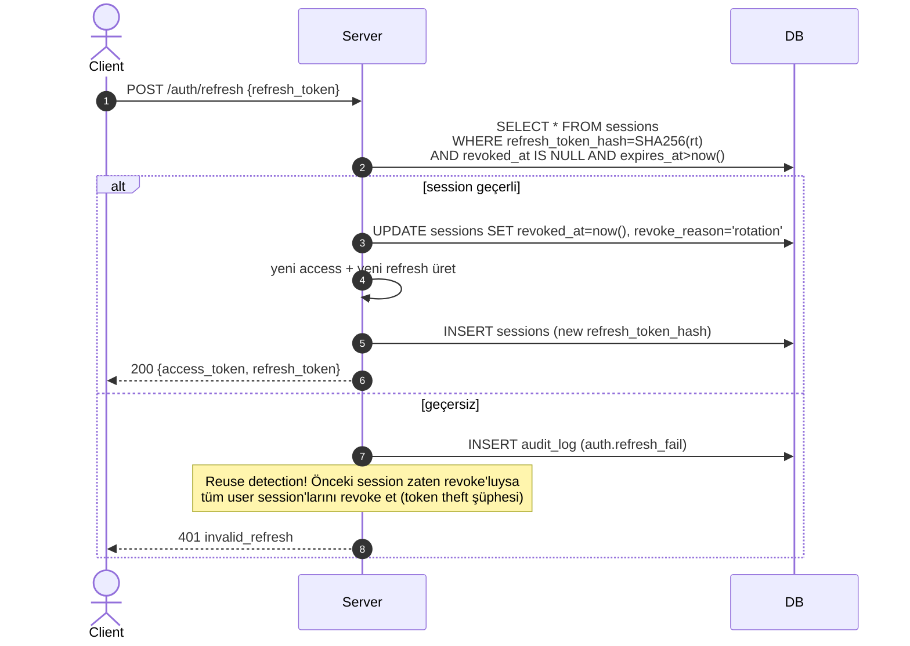
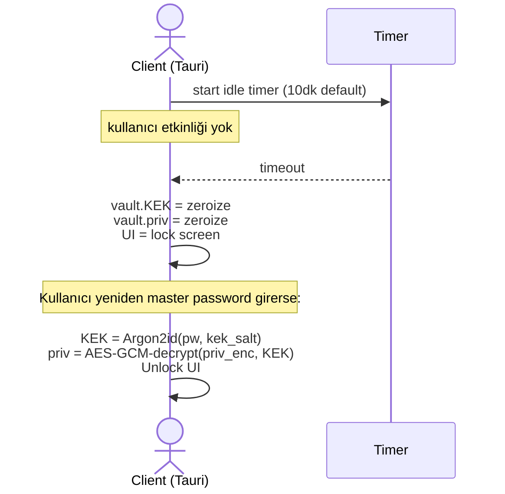
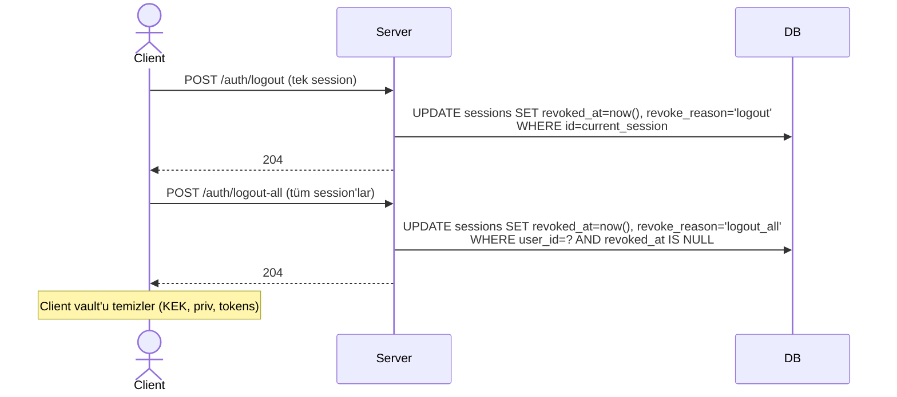
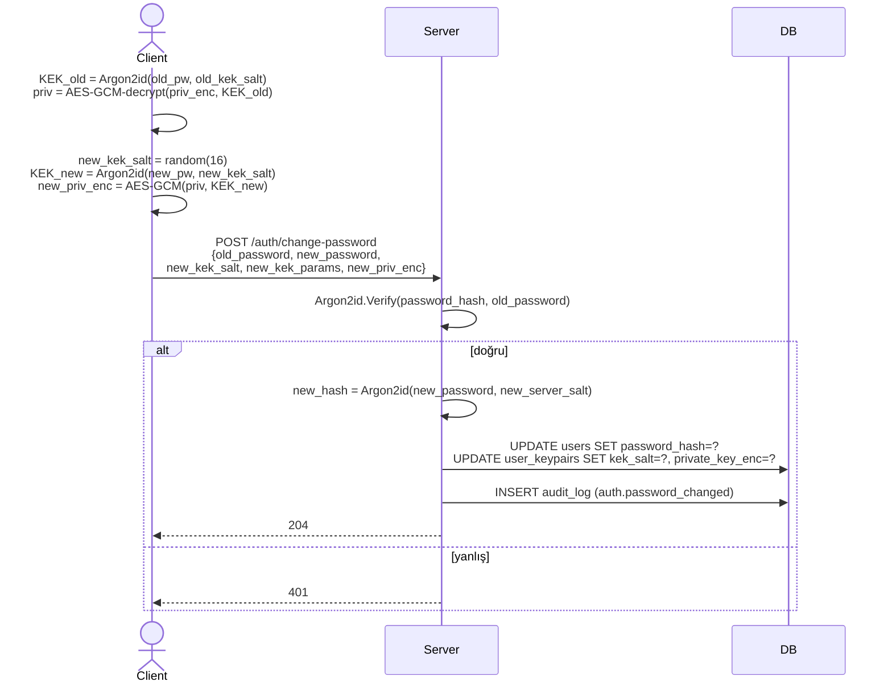
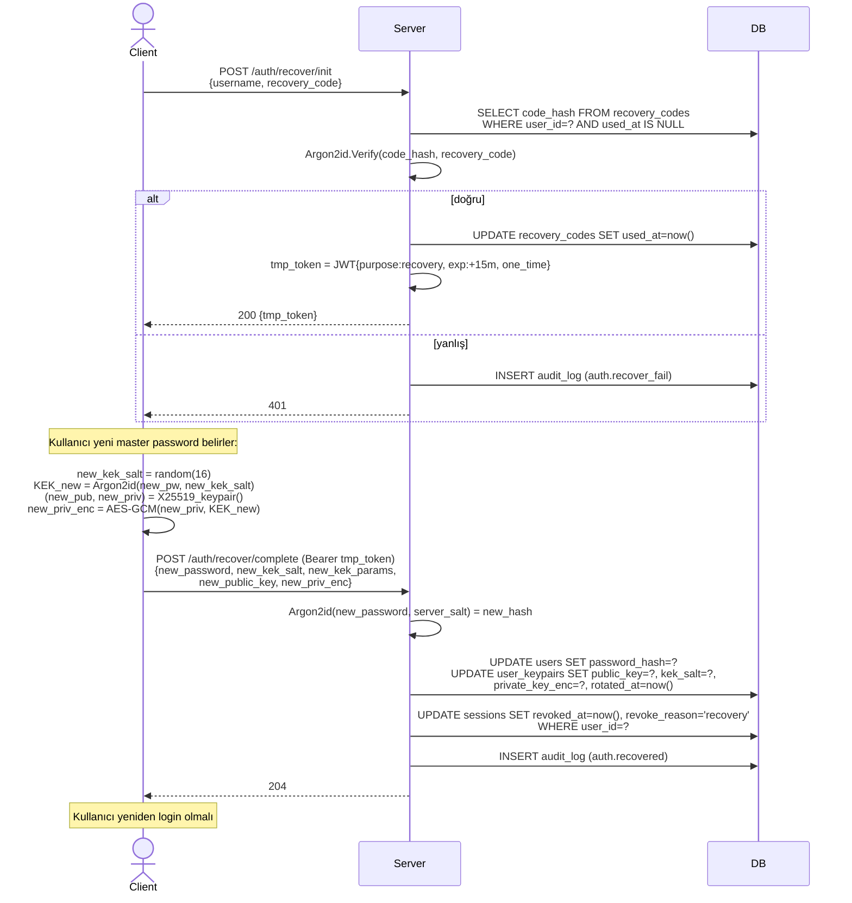
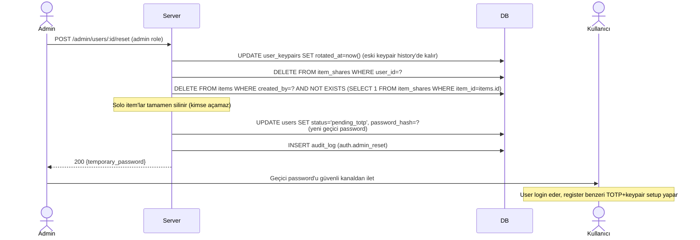

# Authentication & Authorization — Akış Dokümantasyonu

Bu belge kimlik doğrulama ve yetkilendirme akışlarını kullanıcı-seviyesinde anlatır. Kripto detayları için → [ADR-0004](adr/0004-encryption-details.md). Güvenlik modeli özeti için → [ADR-0002](adr/0002-security-model.md).

## Kararlar (Özet)

| Karar | Seçim |
|-------|-------|
| Şifre hash | Argon2id (t=3, m=64MiB, p=4) |
| MFA | TOTP (RFC 6238), kayıt tamamlanması **zorunlu** — setup bitmeden login açılmaz |
| Session token | JWT access (15dk) + opaque refresh (7g, rotating) |
| Refresh rotation | Kullanımda yeni token üretilir, eskisi revoke |
| E2E keypair | X25519, kullanıcının master password'undan türeyen KEK ile korunan private key |
| Recovery | 10 adet 16-haneli kod (Argon2id hash'li saklanır), **yeniden erişim için, solo item kurtarma için değil** |
| Auto-lock | Client 10dk idle default (5/10/15/30dk configurable). KEK + priv RAM'den silinir; session token'lar durur → sadece master password ile unlock |
| Session binding | UA/IP değişimi **flag** (audit log + opsiyonel bildirim), block değil. Refresh token reuse → tüm session'lar revoke |
| Rate limit | `/login`, `/totp/verify`, `/recover`: kullanıcı başına 5 deneme / 15dk |

## Senaryolar

### 1. Kayıt (Register)

Kayıt, TOTP kurulumu tamamlanmadan **login yapılamayacak** bir taslak state'te biter — admin sonradan hesabı activate eder veya kullanıcı TOTP'yi tamamlar.



**Önemli:**
- `master_password` **TLS içinden ham olarak** gönderilir. Server Argon2id hash'ler ve orijinali siler.
- `password_hash` ve `KEK` **farklı salt'larla** türetilir — biri server DB'de, diğeri client'ta KEK türetimi için.
- `users.status = 'pending_totp'`: login denemesi bu statüde iken rejected. TOTP kurulunca `active`.

### 2. TOTP Enrollment (2FA Setup)

Register sonrası zorunlu adım. Kullanıcı QR kod tarar, ilk kodu girer.



**Dikkat:**
- TOTP secret (20B) server-side envelope encrypted → server kullanır ama DB-at-rest'te şifreli.
- Recovery code'lar **bir kere** döner. Kaydetmezse kullanıcı kaybeder.

### 3. Login

Tek adımda 3 doğrulama: password + TOTP + E2E key unwrap.



### 4. Access Token Refresh

Access token 15dk sonra expire olur. Refresh rotation: kullanılan refresh **tek kullanımlık**.



**Kritik:** Aynı refresh token iki kez kullanılmaya çalışılırsa, token çalındı demektir. Tüm session'lar revoke edilir (user force re-login).

### 5. Auto-Lock (Client Idle)



**Not:**
- `access_token` ve `refresh_token` auto-lock'ta **silinmez** — bir sonraki API call için lazım (background sync).
- `KEK` ve `priv` **silinir** — secret field decrypt edemez hale gelir.

### 6. Logout

İki varyant:



### 7. Master Password Değiştirme (Biliniyor)

Mevcut password bilindiği için E2E priv key korunur — sadece KEK ve `private_key_enc` yeniden üretilir.



**Kritik:** `priv` korunduğu için kullanıcı tüm item_shares'i açmaya devam eder. **Veri kaybı yok.**

### 8. Master Password Recovery (Unutulmuş)

Kullanıcı password'u unuttu → recovery code ile girer → **yeni keypair** üretir → solo item'ları kaybeder.



**Sonuç:**
- Eski `user_keypairs.public_key` değişti → item_shares'teki wrapped DEK'lere eski priv ile artık erişim yok.
- **Solo item'lar** (sadece bu user'ın paylaştığı) → kaybedildi. DB'de duruyor ama okunamıyor (admin bile açamaz).
- **Paylaşımlı item'lar**: Diğer sahipler kullanıcıyı yeniden item'a ekleyerek erişimi geri verebilir (yeni public_key ile wrap).
- UI'da **prominent uyarı**: "Recovery yeniden girişinizi sağlar, ama solo kayıtlarınız kaybolacak."

### 9. Admin User Reset (Nükleer Seçenek)

Kullanıcı master password + recovery code **ikisini de** kaybettiyse: admin hesabı reset edebilir. Kullanıcının **tüm verileri kaybolur** (yeni keypair ile başlar).



## RBAC — 3 Katmanlı Yetkilendirme

Detay: [ADR-0006](adr/0006-data-model-extensions.md) §3-4.

### Katmanlar

```
1. Global rol           (users ↔ roles)          admin | write | read
2. Klasör-level ACL     (folder_permissions)     user×folder → read|write, inherit
3. Item-level share     (item_shares)            user×item → read|write
```

### Effective Permission Hesabı

```python
def can_access(user, item, required='read') -> bool:
    # 1. admin her şeye erişir
    if 'admin' in user.global_roles: return True

    # 2. Item-level share (en spesifik)
    if item_shares.has(user, item, required): return True

    # 3. Folder-level ACL (en yakın ancestor folder'ın inherit izni)
    for folder in item.folder.ancestors_including_self():
        perm = folder_permissions.get(user, folder)
        if perm and perm.inherit_to_children and perm.permission >= required:
            return True

    # 4. Global role (salt okuma için fallback, yazma asla global değil)
    if required == 'read' and 'read' in user.global_roles:
        return False  # okuma yine de explicit share/folder perm istiyor — güvenli default
    return False
```

**Not:** Global `read` rolü "tüm envantere okuma" demez — sadece login yapabilme + explicit izin verilen kaynakları görme. Global `write` rolü item/folder oluşturma yetkisi verir, ama neyi görüp düzenleyebileceği folder/item izinlerine bağlıdır.

### Endpoint Matrix (özet)

| Endpoint | admin | write | read | public |
|----------|-------|-------|------|--------|
| `POST /auth/register` | — | — | — | ✓ (veya admin-invited, Faz 2 karar) |
| `POST /auth/login` | ✓ | ✓ | ✓ | ✓ |
| `GET /items`, `GET /folders` | ✓ (hepsi) | ✓ (yetkili) | ✓ (yetkili) | — |
| `POST /items`, `POST /folders` | ✓ | ✓ (yetkili folder'da) | — | — |
| `PUT /items/:id` | ✓ | ✓ (owner, write share, write folder ACL) | — | — |
| `DELETE /items/:id` | ✓ | ✓ (owner) | — | — |
| `POST /items/:id/shares` | ✓ | ✓ (owner) | — | — |
| `POST /folders/:id/permissions` | ✓ | ✓ (owner veya folder write) | — | — |
| `POST /admin/users` | ✓ | — | — | — |
| `GET /admin/audit` | ✓ | — | — | — |
| `POST /field-definitions`, `POST /item-types` | ✓ | — | — | — |

### Örnek Senaryolar

- **DBA (global write):** ProjeA klasörüne `write` folder perm ile grant'lı. ProjeB'ye yok. ProjeA içindeki tüm item'ları görür/düzenler; ProjeB'den bile bahsedilmez (klasör listesinde görünmez).
- **Audit personeli (global read):** Hiçbir klasöre perm yok, hiçbir item share yok. Sadece `/admin/audit` okuyabilir (admin değil, ama audit-specific rol gelirse — ileride Faz 5).
- **Geliştirici (global write, sadece Test klasörü):** /ProjeA/Test folder perm=write + inherit. Test altındaki tüm item'ları oluşturup silebilir. Prod altına bakamaz.
- **Admin:** Her şeyi görür. Sadece admin kendi field_definitions / item_types oluşturabilir.

## Güvenlik Kısıtları (Genel)

- **Rate limit:** `/login`, `/totp/verify`, `/recover/init`, `/refresh` — kullanıcı başına 5 deneme / 15dk. IP başına global 100/dk.
- **Account lockout:** 10 başarısız login → 30dk lock (`users.locked_until`). Admin manuel unlock.
- **Session binding:** Refresh token + User-Agent + IP birlikte kaydedilir. Ağırlıklı UA/IP değişimi → suspicious flag (logged, blocked değil — mobile/VPN için).
- **Token storage (client):**
  - access_token → RAM only
  - refresh_token → Tauri: OS secure storage (Keychain / DPAPI). Web: HttpOnly secure SameSite=Strict cookie
  - KEK + priv → RAM only, auto-zeroize on lock
- **TLS:** Production'da HTTP redirect zorunlu.
- **Audit:** Her auth event audit_log'da (success + fail).

## Error Codes (OpenAPI v1 için referans)

| Kod | Mesaj | Kullanım |
|-----|-------|----------|
| `invalid_credentials` | Kullanıcı adı veya parola hatalı | login password verify fail |
| `invalid_mfa` | TOTP kodu geçersiz | login TOTP fail |
| `account_locked` | Çok fazla deneme, hesap kilitli | account lockout aktif |
| `account_pending_totp` | TOTP kurulumu tamamlanmadı | login ama status=pending_totp |
| `invalid_recovery_code` | Kurtarma kodu geçersiz | recovery/init fail |
| `invalid_refresh` | Refresh token geçersiz / kullanılmış | refresh fail |
| `token_reuse_detected` | Tekrar kullanım tespit edildi | refresh token reuse — hepsi revoke |
| `rate_limited` | Çok fazla istek, bekleyin | rate limit |

## Client Implementation Notları (Faz 4)

- **Tauri'de priv + KEK saklama:** Rust tarafında `zeroize` crate ile `Drop` sırasında explicit zero. Memory dump'larda sızmaması için.
- **UI auto-lock timer:** DOM event listener'ları (click, keypress) reset timer. Son event'ten 5dk sonra trigger.
- **OS lock/sleep integration:** Ekran kilitlenirse → anında auto-lock. Tauri'de `window.on_event(FocusLost)` değil, OS API gerekli (faz 4 detay).

## Faz Sorumlulukları

| Faz | İş |
|-----|-----|
| **Faz 2** | Server: `/auth/*` endpoint'ler, Argon2id + TOTP + JWT, session store |
| **Faz 2** | Rate limit middleware, account lockout |
| **Faz 3** | Web UI: login + MFA sayfaları (server session kullanır, E2E yok web'de) |
| **Faz 4** | Client: register + login + KEK derive + auto-lock + recovery UI |
