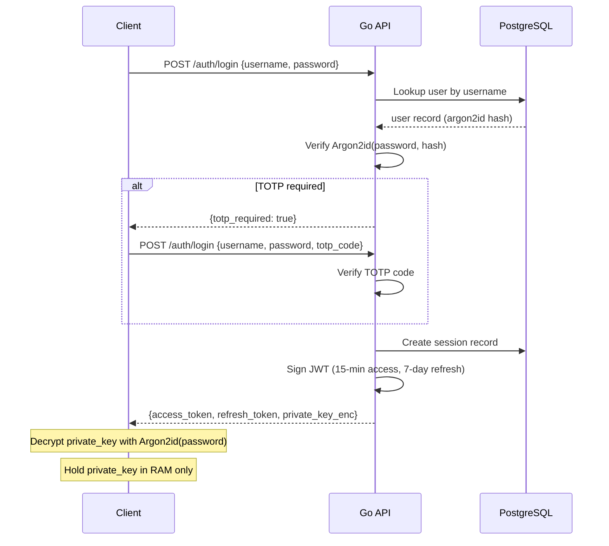

# IronStock Server

<p>
  
  
  
</p>

Go REST + WebSocket API server powering IronStock. Handles authentication, encryption, RBAC, real-time sync, and all integrations.

---

## Architecture

```mermaid
graph TD
    main["cmd/api/main.go\ngraceful shutdown"]
    router["httpapi/router.go\nchi v5 router"]

    main --> router

    router --> mw_authn["middleware_authn\nJWT + session check"]
    router --> mw_rbac["middleware_rbac\nfolder-level RBAC"]
    router --> mw_rl["middleware_ratelimit\ntoken bucket / Redis"]

    router --> auth_h["auth_handlers\nlogin, register, TOTP, WebAuthn"]
    router --> auth_sso["auth_sso\nOIDC, LDAP, JWKS verification"]
    router --> item_h["item_handlers\nCRUD, search, duplicates, health"]
    router --> folder_h["folder_handlers\nCRUD, permissions, sharing"]
    router --> vault_h["vault_handlers\nVault proxy, dynamic creds"]
    router --> k8s_h["admin_k8s\ncluster mgmt, proxy, scanning"]
    router --> scim_h["scim_handlers\nSCIM 2.0 provisioning"]
    router --> admin_h["admin_*\nusers, audit, export, reports"]
    router --> ws_h["WebSocket\nhub + Redis pub/sub"]

    auth_h --> auth["auth/\nJWT, Argon2id, sessions"]
    auth_h --> crypto["crypto/\nenvelope, X25519, AES-GCM"]
    item_h --> db["db/\npgx pool, migrations"]
    vault_h --> vault_c["vault/\nHashiCorp Vault client"]
    k8s_h --> k8s_c["k8s/\nK8s client, SSRF guard"]
    ws_h --> ws_c["ws/\nhub, Redis fan-out"]
    admin_h --> email_c["email/\nSMTP + templates"]
    router --> cache["cache/\nRedis circuit-breaker"]
    router --> metrics["metrics/\nPrometheus"]
```



---

## Package Reference

| Package | Description |
|---------|-------------|
| `cmd/api` | HTTP server entry point with graceful shutdown |
| `cmd/mcp` | MCP JSON-RPC 2.0 stdio server (6 read-only tools) |
| `httpapi` | All HTTP handlers + middleware (auth, RBAC, rate limit, CORS) |
| `auth` | JWT signer, Argon2id hasher, session management |
| `crypto` | Envelope encryption, X25519 key exchange, AES-GCM, search hashing |
| `db` | PostgreSQL connection pool, migration runner |
| `k8s` | Kubernetes client, resource fetcher, SSRF protection |
| `ws` | WebSocket hub, connection lifecycle, Redis pub/sub fan-out |
| `cache` | Redis client wrapper with circuit-breaker (5 errors → 30s open) |
| `config` | Environment-based configuration |
| `audit` | Audit event type constants |
| `email` | SMTP client + 6 HTML email templates |
| `geoip` | ip-api.com GeoIP lookup + Tor exit node detection (24h cache) |
| `health` | Item health score engine (0-100, 8 scoring rules) |
| `llm` | LLM client (Anthropic / OpenAI-compatible) |
| `logfwd` | Log forwarding (Syslog RFC 5424 + Splunk HEC) |
| `metrics` | Prometheus counters, gauges, histograms |
| `storage` | MinIO/S3 client for attachments |
| `vault` | HashiCorp Vault client (KV + dynamic credentials) |
| `webauthn` | WebAuthn/FIDO2 service wrapper |
| `clientcert` | mTLS client certificate management |

---

## API Endpoints

### Authentication

| Method | Path | Description |
|--------|------|-------------|
| POST | `/api/v1/auth/register` | Register with public key |
| POST | `/api/v1/auth/login` | Login (Argon2id + optional TOTP/WebAuthn) |
| POST | `/api/v1/auth/refresh` | Refresh access token |
| POST | `/api/v1/auth/logout` | Revoke session |
| POST | `/api/v1/auth/forgot-password` | Initiate password reset |
| POST | `/api/v1/auth/reset-password` | Complete password reset |
| GET/POST | `/api/v1/auth/totp/*` | TOTP setup + verification |
| GET/POST | `/api/v1/auth/webauthn/*` | WebAuthn register + login |

### SSO

| Method | Path | Description |
|--------|------|-------------|
| GET | `/api/v1/auth/sso/providers` | List configured SSO providers |
| GET | `/api/v1/auth/sso/:provider/authorize` | Initiate OIDC/LDAP flow |
| GET/POST | `/api/v1/auth/sso/:provider/callback` | SSO callback (JWKS verified) |

### Inventory

| Method | Path | Description |
|--------|------|-------------|
| GET/POST | `/api/v1/folders` | List / create folders |
| GET/PUT/DELETE | `/api/v1/folders/:id` | Folder CRUD |
| POST | `/api/v1/folders/:id/permissions` | Share folder |
| GET/POST | `/api/v1/items` | List / create items |
| GET/PUT/DELETE | `/api/v1/items/:id` | Item CRUD |
| GET | `/api/v1/items/search` | Full-text + fuzzy search |
| GET | `/api/v1/items/duplicates` | Duplicate detection |
| GET | `/api/v1/items/:id/health` | Item health score |
| GET | `/api/v1/items/health-report` | Vault-wide health report |
| POST/DELETE | `/api/v1/items/:id/dynamic-cred` | Dynamic Vault credentials |

### Admin

| Method | Path | Description |
|--------|------|-------------|
| GET | `/api/v1/admin/users` | User management |
| GET | `/api/v1/admin/audit-log` | Audit log (6 filters) |
| GET/POST | `/api/v1/admin/sso` | SSO provider configuration |
| GET/PATCH | `/api/v1/admin/ip-restrictions` | GeoIP + CIDR rules |
| POST | `/api/v1/admin/export/encrypted` | Encrypted bulk export |
| GET/POST | `/api/v1/admin/k8s/clusters` | Kubernetes cluster management |
| GET | `/api/v1/admin/reports/generate` | HTML report generation |

### Integrations

| Method | Path | Description |
|--------|------|-------------|
| GET | `/api/v1/ansible/inventory` | Ansible dynamic inventory |
| * | `/scim/v2/*` | SCIM 2.0 provisioning (Users + Groups) |
| GET | `/api/v1/ws` | WebSocket upgrade (real-time sync) |
| GET | `/metrics` | Prometheus metrics |

---

## Authentication Flow



---

## Configuration

All configuration is via environment variables:

| Variable | Default | Description |
|----------|---------|-------------|
| `ENVANTER_LISTEN` | `:8080` | Server listen address |
| `ENVANTER_DATABASE_URL` | required | PostgreSQL connection string |
| `ENVANTER_MASTER_KEY` | required | 32-byte hex master encryption key |
| `ENVANTER_JWT_SECRET` | required | JWT signing secret |
| `ENVANTER_CORS_ORIGINS` | `*` | Comma-separated allowed CORS origins |
| `ENVANTER_REDIS_URL` | optional | Redis URL for caching + pub/sub |
| `ENVANTER_REDIS_PASSWORD` | optional | Redis password |
| `ENVANTER_MINIO_ENDPOINT` | optional | MinIO/S3 endpoint |
| `ENVANTER_MINIO_ACCESS_KEY` | optional | MinIO access key |
| `ENVANTER_MINIO_SECRET_KEY` | optional | MinIO secret key |
| `ENVANTER_VAULT_ADDR` | optional | HashiCorp Vault address |
| `ENVANTER_VAULT_TOKEN` | optional | Vault token |
| `ENVANTER_SMTP_HOST` | optional | SMTP server for email |
| `ENVANTER_SMTP_PORT` | `587` | SMTP port |
| `ENVANTER_LLM_PROVIDER` | optional | `anthropic` or `openai` |
| `ENVANTER_LLM_API_KEY` | optional | LLM API key |
| `ENVANTER_RATE_LIMIT_BACKEND` | `memory` | `memory` or `redis` |

---

## Database

60 PostgreSQL migrations managed by Goose:

```bash
# Apply all migrations
make migrate

# Or manually
cd server
go run cmd/api/main.go --migrate
```

Key tables: `users`, `sessions`, `folders`, `folder_permissions`, `items`, `item_fields`, `item_shares`, `audit_events`, `api_tokens`, `sso_providers`, `k8s_clusters`, and more.

---

## Development

### Prerequisites

- Go 1.22+
- PostgreSQL 16
- (Optional) Redis, MinIO, HashiCorp Vault

### Run

```bash
# Start dependencies
make up  # Docker Compose: PostgreSQL + MinIO + Redis

# Run server
cd server
go run cmd/api/main.go

# Run MCP server
cd server
go run cmd/mcp/main.go
```

### Test

```bash
cd server
go test ./...
```

### Build

```bash
cd server
go build -o ironstock-api cmd/api/main.go
go build -o ironstock-mcp cmd/mcp/main.go
```

---

## Security Features

- **Session revocation** &mdash; database-backed session checking on every request
- **OIDC JWKS verification** &mdash; RSA signature validation with 1-hour key cache
- **SSRF protection** &mdash; reject loopback, link-local, and metadata IPs in K8s URLs
- **Path traversal guard** &mdash; block `..`, `//`, backslash, control chars in Vault paths
- **Rate limiting** &mdash; per-IP token bucket or Redis sliding window (Lua script)
- **Request size limits** &mdash; `MaxBytesReader` on request bodies
- **GeoIP + IP whitelist** &mdash; country and CIDR-based access control with Tor detection
