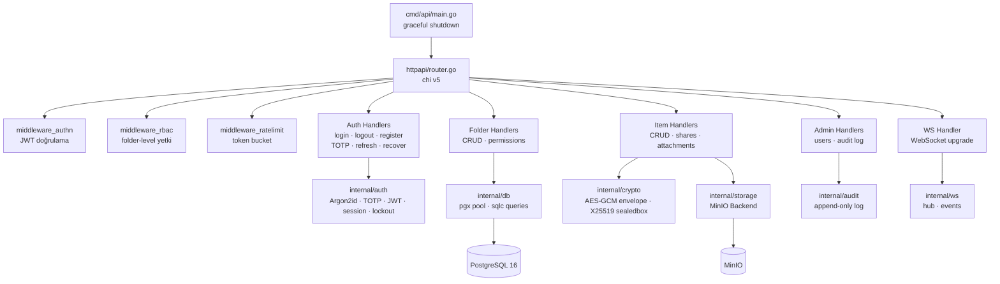
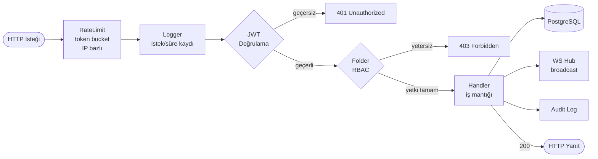
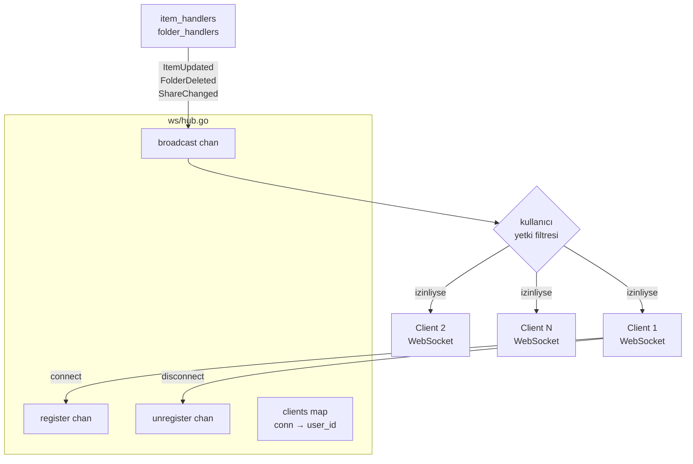
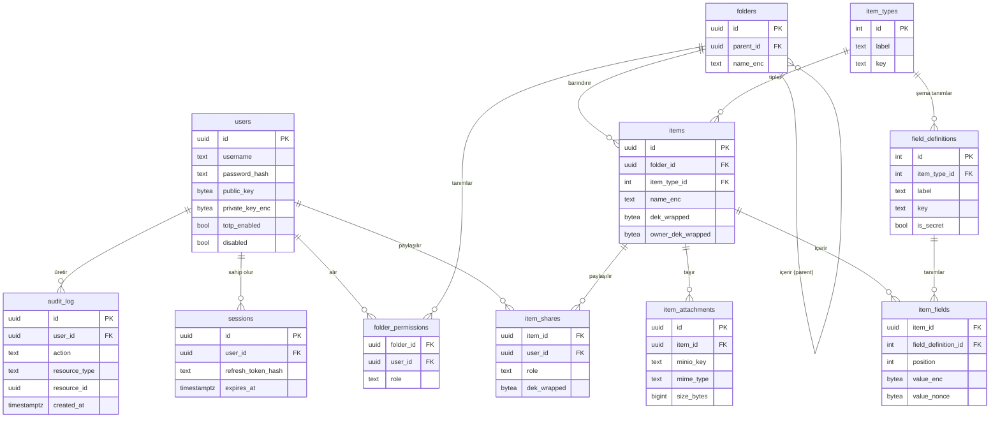
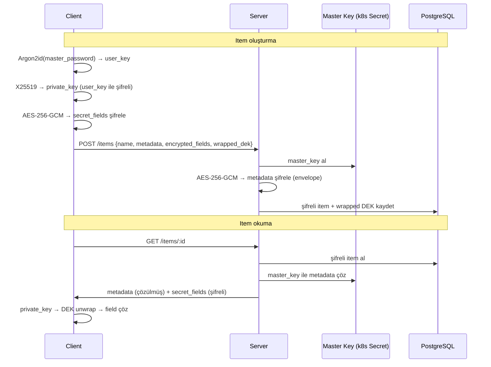

# Server

Go 1.22 tabanlı REST + WebSocket API sunucusu.
PostgreSQL 16, envelope şifreleme, RBAC, audit log ve MinIO nesne depolama entegrasyonu içerir.

---

## Paket Mimarisi



---

## İstek Yaşam Döngüsü (Middleware Zinciri)



---

## Internal Paketler

| Paket | Sorumluluk |
|-------|-----------|
| `auth` | Argon2id hash, TOTP (RFC 6238), JWT access/refresh, session, hesap kilitleme, recovery code |
| `crypto` | AES-256-GCM envelope şifreleme (metadata), X25519 sealed box (E2E key wrap), Argon2id KDF, arama hash'i |
| `db` | pgx/v5 bağlantı havuzu, sqlc üretilmiş sorgular, goose migration runner |
| `httpapi` | chi router, tüm handler'lar, 3 middleware katmanı (authn, RBAC, rate-limit), hata biçimlendirme |
| `ws` | WebSocket bağlantı hub'ı, olay tanımları, client yayın yönetimi |
| `audit` | Mutasyon olayları (auth, CRUD, permission) kayıt, server-side plaintext |
| `storage` | `Backend` arayüzü + `MinioBackend` (EnsureBucket, Put, Get, Delete, presign URL) |
| `config` | Ortam değişkeni tabanlı yapılandırma yükleme |
| `logging` | Yapılandırılmış loglama |
| `metrics` | Prometheus `/metrics` enstrümantasyonu |

---

## WebSocket Hub



---

## API Endpoint Özeti

```
POST   /auth/register           Kullanıcı kaydı
POST   /auth/login              Login → access + refresh token
POST   /auth/logout             Refresh token iptal
POST   /auth/refresh            Access token yenileme
POST   /auth/totp/enroll        TOTP kaydı başlat
POST   /auth/totp/verify        TOTP doğrulama + etkinleştirme
POST   /auth/change-password    Parola değiştirme
POST   /auth/recover            Recovery code ile parola sıfırlama

GET    /catalog/item-types      Item type tanımları
GET    /catalog/field-defs      Alan tanımları

GET    /folders                 Klasör ağacı
POST   /folders                 Yeni klasör
PATCH  /folders/:id             Klasör güncelle
DELETE /folders/:id             Klasör sil
GET    /folders/:id/permissions Klasör yetkileri
PUT    /folders/:id/permissions Klasör yetki güncelle

GET    /items?folder_id=        Item listesi
POST   /items                   Yeni item (şifreli field değerleriyle)
GET    /items/:id               Item detayı
PATCH  /items/:id               Item güncelle
DELETE /items/:id               Item sil
GET    /items/:id/shares        Item paylaşımları
PUT    /items/:id/shares        Item paylaşım güncelle

POST   /items/:id/attachments   Presigned upload URL al
GET    /items/:id/attachments   Ek listesi
GET    /items/:id/attachments/:aid  Presigned download URL al
DELETE /items/:id/attachments/:aid  Ek sil

GET    /admin/users             Kullanıcı listesi (admin)
PATCH  /admin/users/:id         Kullanıcı güncelle (admin)
POST   /admin/users/:id/disable Kullanıcıyı devre dışı bırak
GET    /admin/audit             Audit log (sayfalı)

GET    /healthz                 Sağlık kontrolü (k8s probe)
GET    /metrics                 Prometheus metrikleri
WS     /ws                      WebSocket bağlantısı
```

---

## Veritabanı Şeması (ER)



---

## Şifreleme Akışı



---

## Migration Listesi

| No | Dosya | İçerik |
|----|-------|--------|
| 1 | `00001_init_extensions.sql` | pgcrypto extension + `set_updated_at()` trigger |
| 2 | `00002_users.sql` | Kullanıcı tablosu, Argon2id hash, durum, soft-lock |
| 3 | `00003_roles.sql` | Roller (read, write) + user_roles |
| 4 | `00004_sessions.sql` | Refresh token deposu |
| 5 | `00005_audit_log.sql` | Audit trail + BRIN index |
| 6 | `00006_master_keys.sql` | Server-side envelope master key metadata |
| 7 | `00007_user_keypairs.sql` | X25519 public/private key çiftleri |
| 8 | `00008_totp_secrets.sql` | TOTP gizli anahtarları |
| 9 | `00009_recovery_codes.sql` | Hesap kurtarma kodları |
| 10 | `00010_item_types.sql` | Item tipi tanımları |
| 11 | `00011_field_definitions.sql` | Alan şema tanımları |
| 12 | `00012_folders.sql` | Klasör ağacı (self-referential) |
| 13 | `00013_folder_permissions.sql` | Klasör × kullanıcı × rol |
| 14 | `00014_items.sql` | Envanter öğeleri (şifreli metadata + DEK) |
| 15 | `00015_item_fields.sql` | E2E şifreli alan değerleri |
| 16 | `00016_item_shares.sql` | Item paylaşımları (DEK wrap dahil) |
| 17 | `00017_item_relationships.sql` | Item'lar arası ilişkiler |
| 18 | `00018_item_description.sql` | Serbest metin açıklamaları |
| 19 | `00019_item_attachments.sql` | Dosya eki metadata (MinIO key, boyut, MIME) |

---

## Geliştirme

```bash
cd server

# Birim testleri
go test ./...

# Integration testleri (gerçek Postgres, testcontainers)
go test ./internal/db/... -tags integration -timeout 10m

# Lint
golangci-lint run

# Migrasyon uygula
goose -dir migrations postgres "$ENVANTER_DB_URL" up
```

Ortam değişkenleri için kök dizindeki `.env.example`'a bakın.
