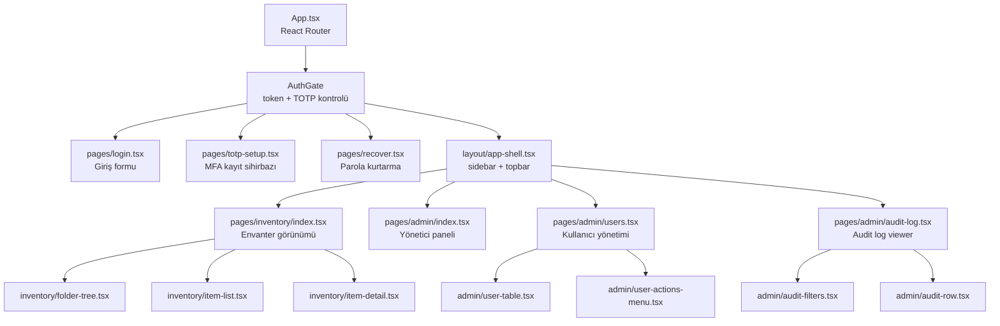
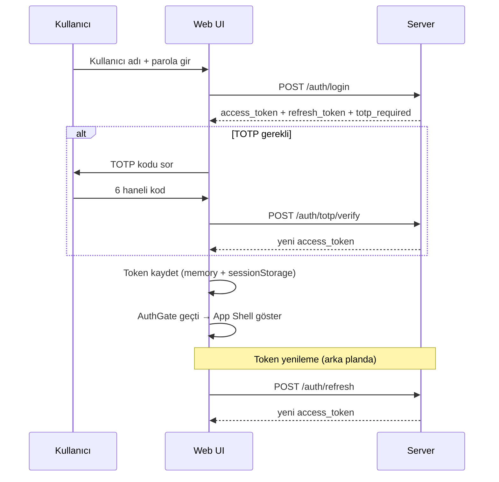
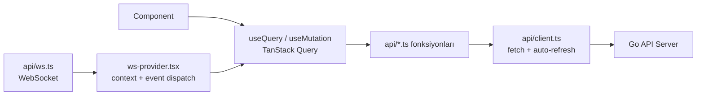
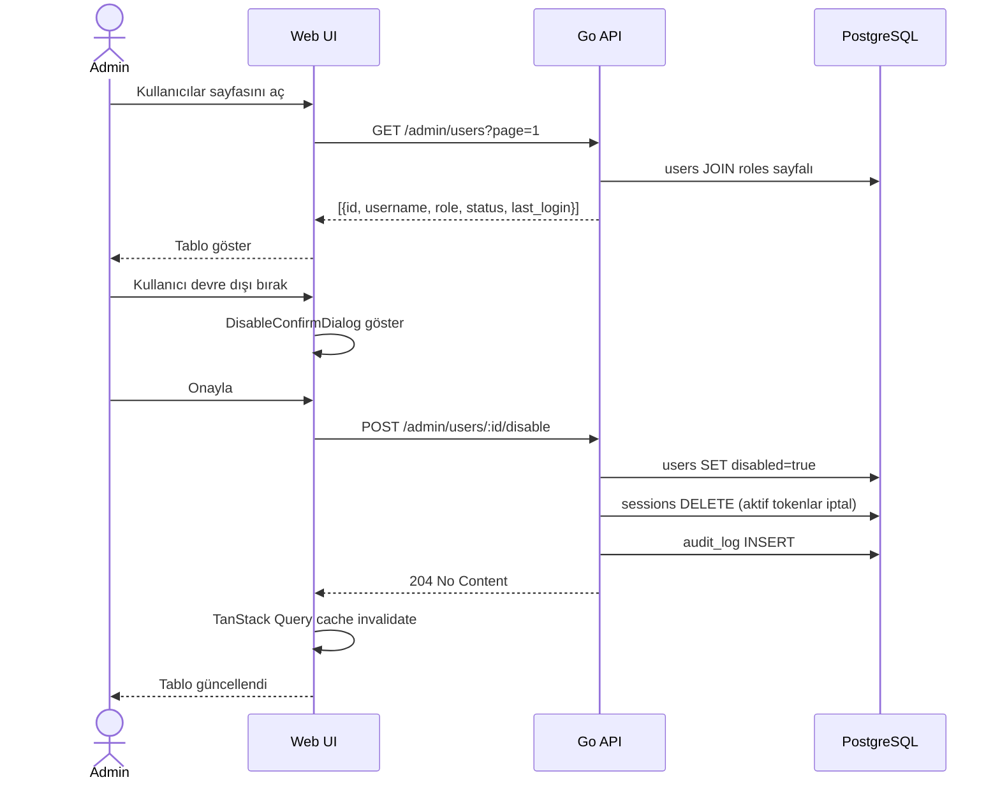
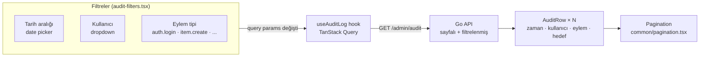

# Web (Admin UI)

React 18 + TypeScript + Vite tabanlı admin paneli.
Kullanıcı yönetimi, audit log izleme ve tam envanter görüntüleme/düzenleme içerir.

---

## Sayfa Yapısı



---

## Kimlik Doğrulama Akışı



---

## API Katmanı



`api/client.ts` 401 aldığında `/auth/refresh` ile token yeniler; başarılıysa orijinal isteği tekrarlar.

---

## Admin Kullanıcı Yönetimi Akışı



---

## Audit Log Görünümü



---

## Bileşen Katmanları

### Admin Bileşenleri (`components/admin/`)

| Bileşen | Açıklama |
|---------|---------|
| `user-table.tsx` | Sayfalı kullanıcı listesi — durum, rol, son giriş |
| `user-actions-menu.tsx` | Dropdown: rol değiştir, devre dışı bırak, parola sıfırla |
| `audit-filters.tsx` | Tarih aralığı + kullanıcı + eylem filtresi |
| `audit-row.tsx` | Log satırı — zaman, kullanıcı, eylem, hedef kaynak |
| `role-badges.tsx` | Renk kodlu rol etiketi (admin / editor / viewer) |
| `status-badge.tsx` | Kullanıcı durumu etiketi (aktif / devre dışı) |

### Envanter Bileşenleri (`components/inventory/`)

| Bileşen | Açıklama |
|---------|---------|
| `folder-tree.tsx` | Genişletilebilir ağaç — inline yeni klasör + izin yönetimi |
| `item-list.tsx` | Seçili klasörün item'ları — arama + sıralama |
| `item-detail.tsx` | Sağ panel: meta + şifreli alanlar + ekler + paylaşım |
| `item-form-modal.tsx` | Yeni item / düzenle — tip seçimi + alan girdileri |
| `item-share-modal.tsx` | Kullanıcı paylaşımı — DEK yeniden wrap |
| `item-attachment-panel.tsx` | Presigned URL ile upload/download |
| `permission-badge.tsx` | `read` / `write` etiketi |

### UI Bileşenleri (`components/ui/`)

shadcn/ui tabanlı 17 primitive: `alert-dialog`, `badge`, `button`, `card`, `checkbox`, `collapsible`, `dialog`, `dropdown-menu`, `input`, `label`, `popover`, `select`, `skeleton`, `table`, `toast`, `toaster`, `tooltip`.

---

## Geliştirme

```bash
cd web

# Bağımlılıklar
npm install

# Dev sunucu (localhost:5173)
npm run dev

# Testler (Vitest + React Testing Library)
npm test

# Tip kontrolü
npx tsc -b

# Lint
npm run lint

# Production build
npm run build
# Çıktı: dist/ — k8s nginx pod'una serve edilir
```

### Ortam Ayarları

| Değişken | Açıklama | Varsayılan |
|---------|---------|---------|
| `VITE_API_URL` | Go API base URL | `http://localhost:8080` |
| `VITE_WS_URL` | WebSocket URL | `ws://localhost:8080/ws` |
