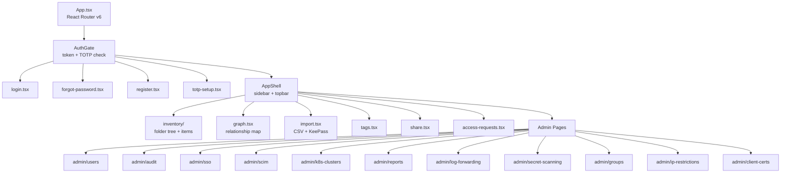
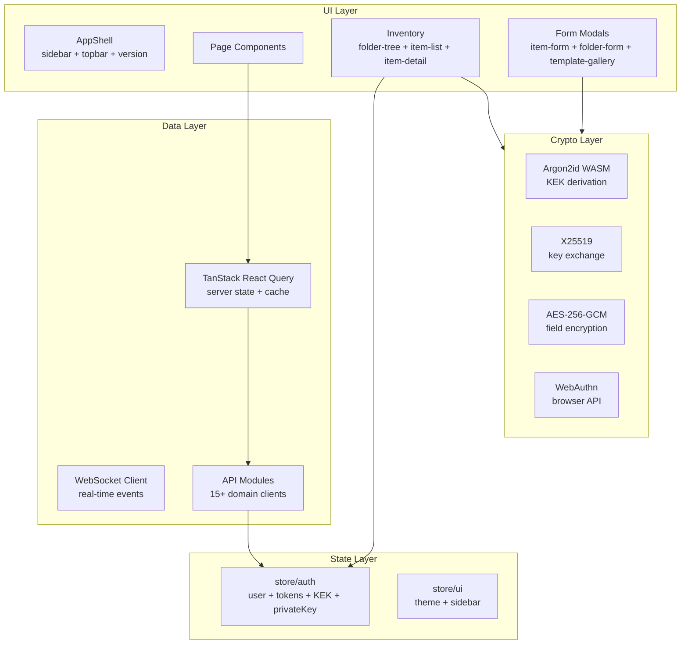

# IronStock Web Admin

<p>
  
  
  
  
  
</p>

Full-featured admin panel for IronStock. Manage users, credentials, folders, audit logs, integrations, and security settings from the browser.

---

## Features

- **Complete vault management** &mdash; folders, items, sharing, tags, relationships
- **Client-side E2E encryption** &mdash; Argon2id + X25519 + AES-256-GCM in the browser
- **Real-time sync** &mdash; WebSocket-powered live updates
- **Admin dashboard** &mdash; users, audit log, SSO, SCIM, K8s clusters, reports
- **Import wizard** &mdash; CSV and KeePass (.kdbx) file import
- **Relationship graph** &mdash; visual item dependency map (React Flow)
- **Health scores** &mdash; credential rotation tracking and expiry alerts
- **AI suggestions** &mdash; LLM-powered field recommendations
- **Auto-versioning** &mdash; version injected from package.json at build time

---

## Page Structure



---

## Component Architecture



---

## API Layer

| Module | Purpose |
|--------|---------|
| `client.ts` | Base fetch wrapper with 401 auto-refresh |
| `token-storage.ts` | In-memory token storage (never localStorage) |
| `ws.ts` | WebSocket client with heartbeat + reconnection |
| `folders.ts` | Folder CRUD + permissions |
| `items.ts` | Item CRUD + search + duplicates |
| `attachments.ts` | Presigned upload/download |
| `shares.ts` | Item sharing |
| `item-links.ts` | Item relationships |
| `templates.ts` | Item templates |
| `vault.ts` | Vault proxy + dynamic credentials |
| `health.ts` | Item health scores |
| `ai-suggestions.ts` | AI-powered suggestions |
| `admin.ts` | User management + export |
| `admin-k8s.ts` | K8s cluster management |
| `reports.ts` | HTML report generation |
| `api-tokens.ts` | API token management |

---

## Client-Side Cryptography

| Function | Algorithm | Purpose |
|----------|-----------|---------|
| KEK derivation | Argon2id (WASM) | Derive key from master password |
| Key exchange | X25519 | Wrap/unwrap per-item DEKs |
| Field encryption | AES-256-GCM | Encrypt/decrypt credential fields |
| Search hashing | HMAC-SHA256 | Blind index for server-side search |
| Hardware auth | WebAuthn | FIDO2 security key support |

---

## UI Components

Built on [shadcn/ui](https://ui.shadcn.com/) (Radix UI primitives + Tailwind CSS):

- Alert Dialog, Checkbox, Collapsible, Dialog, Dropdown Menu
- Label, Popover, Select, Switch, Tabs, Toast, Tooltip
- Custom: ErrorBoundary, FolderTree, ItemDetail, ItemFormModal, TemplateGallery

---

## Development

```bash
cd web
npm install

# Development server (HMR)
npm run dev
# → http://localhost:5173

# Type checking
npx tsc -b

# Lint
npm run lint

# Format
npm run format
```

### Testing

```bash
npm test
# 179 tests across 43 files
```

Tests use Vitest + React Testing Library. Radix UI components are mocked for jsdom compatibility.

### Build

```bash
npm run build
# Output: dist/
```

The build injects `APP_VERSION` from `package.json` via Vite's `define` feature.

---

## Project Structure

```
web/
├── index.html                    # Entry point + CSP meta tag
├── vite.config.ts                # Vite config + version injection
├── vitest.config.ts              # Test config
├── package.json                  # Version source of truth
├── src/
│   ├── main.tsx                  # React root + ErrorBoundary
│   ├── version.ts                # APP_VERSION constant
│   ├── api/                      # API client modules (15+)
│   ├── components/
│   │   ├── layout/               # AppShell, sidebar, topbar
│   │   ├── inventory/            # Folder tree, item detail, forms
│   │   ├── ui/                   # shadcn/ui primitives
│   │   └── ErrorBoundary.tsx     # Global error boundary
│   ├── hooks/                    # Custom React hooks
│   ├── lib/                      # Crypto, WebAuthn, utilities
│   ├── pages/                    # Route page components
│   │   ├── admin/                # Admin pages (11)
│   │   ├── inventory/            # Main credential browser
│   │   └── pipeline/             # Pipeline views
│   ├── routes/                   # Auth gate, connection gate
│   └── store/                    # Zustand state stores
└── tsconfig.json
```
